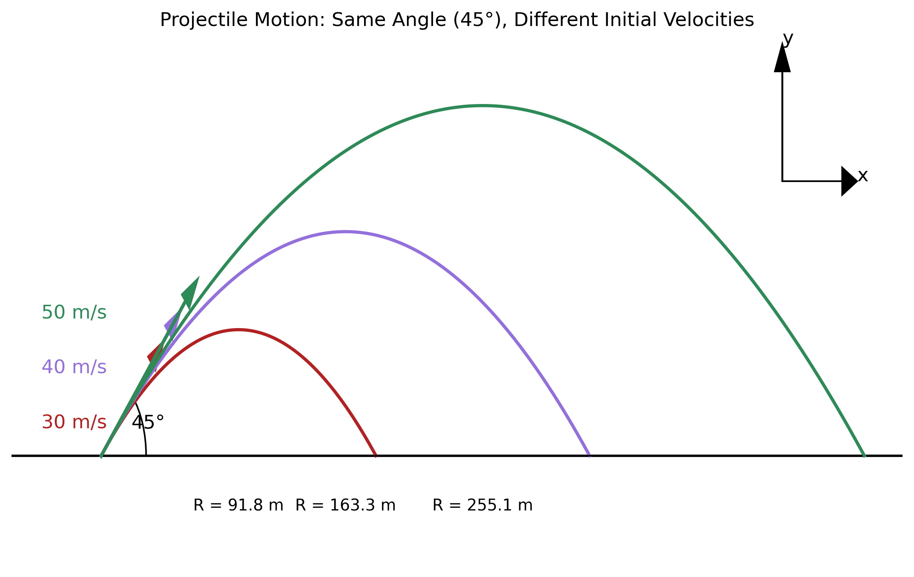
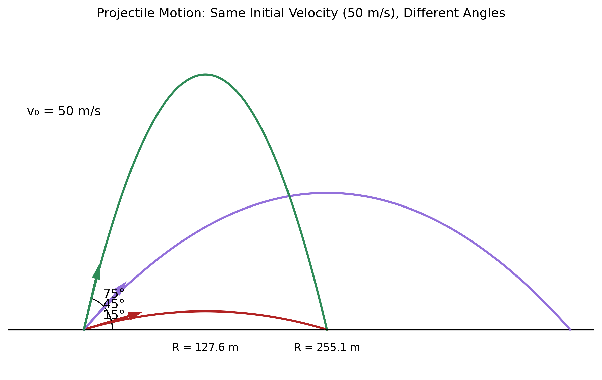

# Investigating the Range as a Function of the Angle of Projection

## Motivation

Projectile motion, while seemingly simple, offers a rich playground for exploring fundamental principles of physics. The problem is straightforward: analyze how the range of a projectile depends on its angle of projection. Yet, beneath this simplicity lies a complex and versatile framework. The equations governing projectile motion involve both linear and quadratic relationships, making them accessible yet deeply insightful.

What makes this topic particularly compelling is the number of free parameters involved in these equations, such as initial velocity, gravitational acceleration, and launch height. These parameters give rise to a diverse set of solutions that can describe a wide array of real-world phenomena, from the arc of a soccer ball to the trajectory of a rocket.

## Theoretical Foundation

### Deriving the Equations of Motion

I'll begin by establishing the governing equations from first principles. Consider a projectile launched from the origin with an initial velocity $v_0$ at an angle $\theta$ with respect to the horizontal.

The initial velocity can be decomposed into horizontal and vertical components:

$v_{0x} = v_0 \cos\theta$
$v_{0y} = v_0 \sin\theta$

Assuming no air resistance and constant gravitational acceleration $g$, the equations of motion are derived from Newton's second law:

$\frac{d^2x}{dt^2} = 0$ (horizontal)
$\frac{d^2y}{dt^2} = -g$ (vertical)

Integrating these differential equations with the initial conditions:
- At $t=0$: $x=0$, $y=0$, $v_x = v_0\cos\theta$, $v_y = v_0\sin\theta$

I obtain:

$x(t) = (v_0\cos\theta)t$
$v_x(t) = v_0\cos\theta$

$y(t) = (v_0\sin\theta)t - \frac{1}{2}gt^2$
$v_y(t) = v_0\sin\theta - gt$

### Time of Flight

To find the range, I first need to determine when the projectile returns to its initial height (y = 0). From the vertical position equation:

$0 = (v_0\sin\theta)t - \frac{1}{2}gt^2$

This gives two solutions: $t = 0$ (initial position) and $t = \frac{2v_0\sin\theta}{g}$ (time of flight).

## Analysis of the Range

### Range Formula

The horizontal range $R$ is the distance traveled during the time of flight:

$R = x(t_{flight}) = (v_0\cos\theta) \cdot \frac{2v_0\sin\theta}{g}$

Simplifying:

$R = \frac{v_0^2\sin(2\theta)}{g}$

This elegant formula reveals that the range depends on:
1. The square of the initial velocity ($v_0^2$)
2. The sine of twice the angle ($\sin(2\theta)$)
3. Inversely proportional to gravitational acceleration ($\frac{1}{g}$)

### Optimizing for Maximum Range

To find the angle that maximizes the range, I differentiate the range formula with respect to $\theta$ and set it equal to zero:

$\frac{dR}{d\theta} = \frac{v_0^2}{g} \cdot 2\cos(2\theta) = 0$

This gives $\cos(2\theta) = 0$, which occurs when $2\theta = 90°$, or $\theta = 45°$.

Therefore, in the absence of air resistance and on level ground, a launch angle of 45° maximizes the range of a projectile.

The maximum range is:

$R_{max} = \frac{v_0^2}{g}$

## Visualization of Projectile Motion

### Effect of Initial Velocity

The range is proportional to the square of the initial velocity. Doubling the initial velocity quadruples the range. This relationship is visualized in the following figure:



*Figure 1: Trajectories of projectiles launched at a 45° angle with different initial velocities (30 m/s, 40 m/s, and 50 m/s). Note how the range increases with the square of the initial velocity.*

In this figure, we can observe that:
- All projectiles are launched at the same angle (45°)
- The red trajectory corresponds to an initial velocity of 30 m/s with a range of 91.8 m
- The purple trajectory corresponds to an initial velocity of 40 m/s with a range of 163 m
- The green trajectory corresponds to an initial velocity of 50 m/s with a range of 255 m

The ratio of ranges (91.8 : 163 : 255) approximately follows the ratio of the squares of velocities (900 : 1600 : 2500), confirming our theoretical prediction.

### Effect of Launch Angle

For a fixed initial velocity, the range varies with the sine of twice the launch angle, reaching its maximum at 45°. This is illustrated in the following figure:



*Figure 2: Trajectories of projectiles launched with the same initial velocity (50 m/s) at different angles (15°, 45°, and 75°). Note how the 45° angle provides the maximum range.*

In this figure, we can observe that:
- All projectiles have the same initial velocity (50 m/s)
- The red trajectory corresponds to a 15° launch angle
- The purple trajectory corresponds to a 45° launch angle with a range of 255 m
- The green trajectory corresponds to a 75° launch angle

Interestingly, the 15° and 75° angles (which are complementary angles that sum to 90°) result in the same range (128 m), which is less than the maximum range achieved at 45°. This demonstrates the symmetry in the range formula around 45°.

## Practical Applications

### Non-level Terrain

When launching a projectile uphill or downhill, the optimal angle changes. For uphill launches, the optimal angle is less than 45°, while for downhill launches, it's greater than 45°.

### Air Resistance

In real-world scenarios, air resistance significantly affects projectile motion. The drag force is approximately proportional to the square of the velocity:

$F_d = -bv^2$

Where $b$ is a constant depending on the projectile's shape, size, and the air density.

With air resistance, the optimal angle is typically less than 45° (often around 30-35° depending on the projectile).

## Implementation: Computational Analysis

I've created a Python script to simulate and visualize projectile motion. The script generates the figures shown above and can be found in the `scripts` directory. Here's a simplified version of the code used to generate these visualizations:

```python
import numpy as np
import matplotlib.pyplot as plt

def plot_trajectory(v0, theta, g=9.8):
    # Convert angle to radians
    theta_rad = np.radians(theta)
    
    # Calculate time of flight
    t_flight = 2 * v0 * np.sin(theta_rad) / g
    
    # Generate time points
    t = np.linspace(0, t_flight, 1000)
    
    # Calculate trajectory
    x = v0 * np.cos(theta_rad) * t
    y = v0 * np.sin(theta_rad) * t - 0.5 * g * t**2
    
    # Calculate range
    R = v0**2 * np.sin(2*theta_rad) / g
    
    return x, y, R
```

This function calculates the trajectory and range of a projectile given its initial velocity and launch angle. The complete script includes additional code for plotting multiple trajectories and adding annotations.

## Limitations and Extensions

### Model Limitations

The ideal projectile motion model has several limitations:
1. Neglects air resistance
2. Assumes constant gravitational acceleration
3. Ignores the Earth's curvature (relevant for very long-range projectiles)
4. Doesn't account for the Coriolis effect due to Earth's rotation

### Incorporating Realistic Factors

To create a more realistic model, I would need to:
1. Add drag forces (proportional to $v^2$)
2. Consider variations in air density with altitude
3. Account for wind effects
4. Include the projectile's spin (Magnus effect)

These additions would require numerical integration methods as the equations become non-linear and lack analytical solutions.

## Conclusion

Through this analysis, I've demonstrated how the range of a projectile depends on its angle of projection. The elegant relationship $R = \frac{v_0^2\sin(2\theta)}{g}$ reveals that a 45° angle maximizes the range under ideal conditions. However, real-world factors like air resistance and varying terrain modify this relationship.

This problem beautifully illustrates how mathematical models in physics can provide both practical insights (like how to achieve maximum distance) and theoretical understanding of natural phenomena. The projectile motion framework serves as a foundation for analyzing more complex systems in ballistics, sports, and aerospace engineering.

