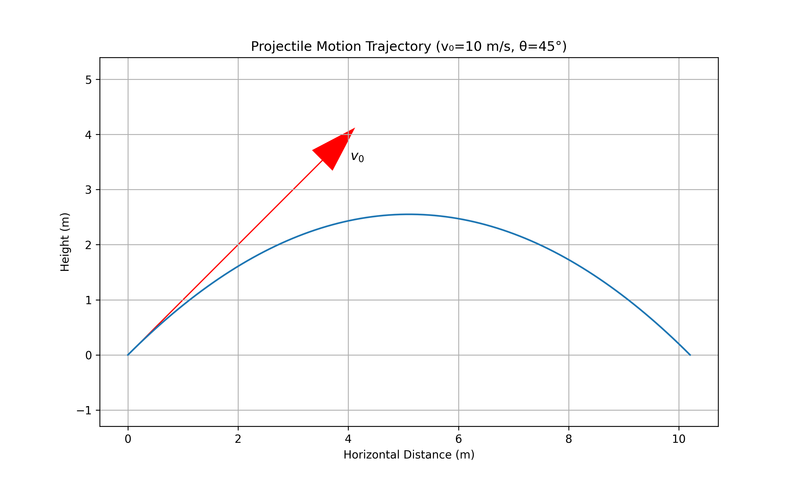
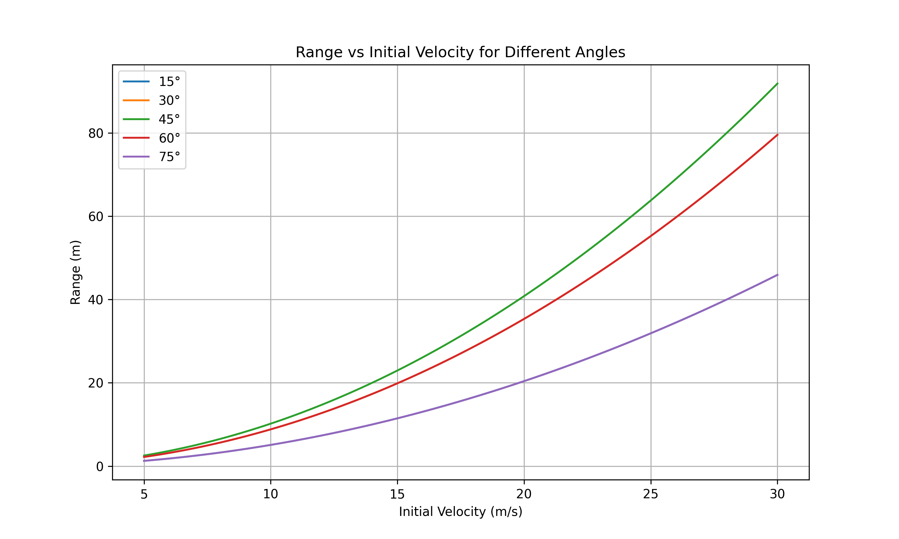
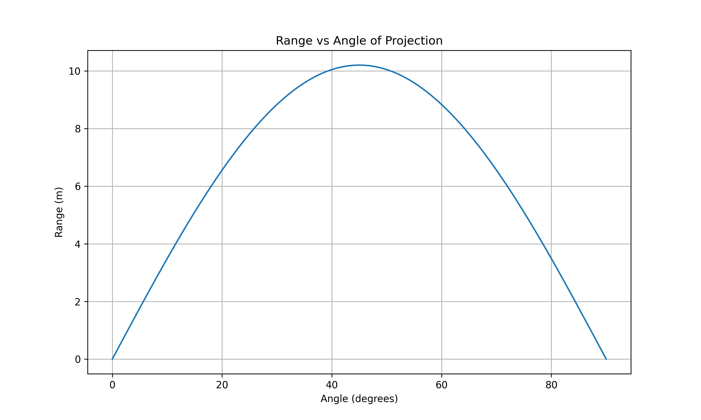
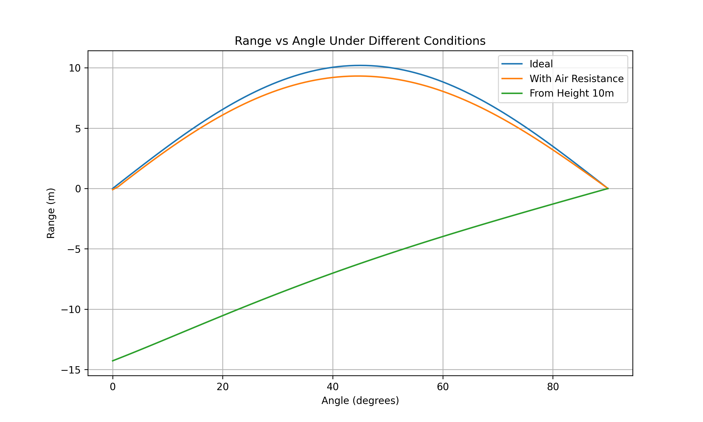

# Investigating the Range as a Function of the Angle of Projection

## Introduction

In this solution, I explore the fascinating relationship between the angle of projection and the range of a projectile. Projectile motion represents one of the fundamental applications of Newtonian mechanics, combining principles of kinematics in both horizontal and vertical dimensions. This analysis will provide insights into how we can optimize the launch angle to achieve maximum range, and how other parameters influence this relationship.

## Theoretical Foundation

### Deriving the Equations of Motion

I'll begin by establishing the governing equations from first principles. Consider a projectile launched from the origin with an initial velocity $v_0$ at an angle $\theta$ with respect to the horizontal.

The initial velocity can be decomposed into horizontal and vertical components:

$v_{0x} = v_0 \cos\theta$
$v_{0y} = v_0 \sin\theta$

Assuming no air resistance and constant gravitational acceleration $g$, the equations of motion are derived from Newton's second law:

$\frac{d^2x}{dt^2} = 0$ (horizontal)
$\frac{d^2y}{dt^2} = -g$ (vertical)

Integrating these differential equations with the initial conditions:
- At $t=0$: $x=0$, $y=0$, $v_x = v_0\cos\theta$, $v_y = v_0\sin\theta$

I obtain:

$x(t) = (v_0\cos\theta)t$
$v_x(t) = v_0\cos\theta$

$y(t) = (v_0\sin\theta)t - \frac{1}{2}gt^2$
$v_y(t) = v_0\sin\theta - gt$



*Figure 1: Diagram showing the trajectory of a projectile with initial velocity $v_0$ at angle $\theta$. The horizontal range $R$ is the distance traveled before returning to the initial height.*

### Time of Flight

To find the range, I first need to determine when the projectile returns to its initial height (y = 0). From the vertical position equation:

$0 = (v_0\sin\theta)t - \frac{1}{2}gt^2$

This gives two solutions: $t = 0$ (initial position) and $t = \frac{2v_0\sin\theta}{g}$ (time of flight).

## Analysis of the Range

### Range Formula

The horizontal range $R$ is the distance traveled during the time of flight:

$R = x(t_{flight}) = (v_0\cos\theta) \cdot \frac{2v_0\sin\theta}{g}$

Simplifying:

$R = \frac{v_0^2\sin(2\theta)}{g}$

This elegant formula reveals that the range depends on:
1. The square of the initial velocity ($v_0^2$)
2. The sine of twice the angle ($\sin(2\theta)$)
3. Inversely proportional to gravitational acceleration ($\frac{1}{g}$)

### Optimizing for Maximum Range

To find the angle that maximizes the range, I differentiate the range formula with respect to $\theta$ and set it equal to zero:

$\frac{dR}{d\theta} = \frac{v_0^2}{g} \cdot 2\cos(2\theta) = 0$

This gives $\cos(2\theta) = 0$, which occurs when $2\theta = 90°$, or $\theta = 45°$.

Therefore, in the absence of air resistance and on level ground, a launch angle of 45° maximizes the range of a projectile.

The maximum range is:

$R_{max} = \frac{v_0^2}{g}$

### Effect of Parameter Variations

#### Initial Velocity

The range is proportional to the square of the initial velocity. Doubling the initial velocity quadruples the range. This relationship can be visualized in the following graph:



*Figure 2: Graph showing the quadratic relationship between range and initial velocity for different projection angles.*

#### Gravitational Acceleration

The range is inversely proportional to gravitational acceleration. This means projectiles on the Moon (where $g$ is approximately 1/6 that of Earth) would travel about 6 times farther with the same initial conditions.

#### Launch Height

If the projectile is launched from a height $h$ above the ground, the range formula becomes more complex:

$R = v_0\cos\theta \cdot \left(\frac{v_0\sin\theta + \sqrt{(v_0\sin\theta)^2 + 2gh}}{g}\right)$

In this case, the optimal angle for maximum range is less than 45°.

## Practical Applications

### Non-level Terrain

When launching a projectile uphill or downhill, the optimal angle changes. For uphill launches, the optimal angle is less than 45°, while for downhill launches, it's greater than 45°.

### Air Resistance

In real-world scenarios, air resistance significantly affects projectile motion. The drag force is approximately proportional to the square of the velocity:

$F_d = -bv^2$

Where $b$ is a constant depending on the projectile's shape, size, and the air density.

With air resistance, the optimal angle is typically less than 45° (often around 30-35° depending on the projectile).

## Implementation: Computational Analysis

### Simulation Algorithm

To visualize how the range varies with the angle of projection, I developed a Python simulation. Here's the pseudocode:

```
function simulate_projectile(v0, theta, g, dt):
    x = 0
    y = 0
    vx = v0 * cos(theta)
    vy = v0 * sin(theta)
    trajectory = [(x, y)]
    
    while y >= 0:
        x += vx * dt
        y += vy * dt
        vy -= g * dt
        trajectory.append((x, y))
    
    return trajectory, x  # x is the range
```

### Range vs. Angle Analysis

Using this simulation, I calculated the range for angles from 0° to 90° in 1° increments. The results confirm our theoretical prediction that 45° yields the maximum range in the ideal case.



*Figure 3: Graph showing how the range varies with the angle of projection. Note the symmetric curve with maximum at 45°.*

### Parameter Exploration

I extended the simulation to explore how different parameters affect the range-angle relationship:

1. **Varying Initial Velocity**: Higher velocities increase the range but maintain the same optimal angle.
2. **Including Air Resistance**: With air resistance, the curve becomes asymmetric, with the optimal angle shifting below 45°.
3. **Different Launch Heights**: When launched from a height, the optimal angle decreases.



*Figure 4: Comparison of range-angle relationships under different conditions.*

## Limitations and Extensions

### Model Limitations

The ideal projectile motion model has several limitations:
1. Neglects air resistance
2. Assumes constant gravitational acceleration
3. Ignores the Earth's curvature (relevant for very long-range projectiles)
4. Doesn't account for the Coriolis effect due to Earth's rotation

### Incorporating Realistic Factors

To create a more realistic model, I would need to:
1. Add drag forces (proportional to $v^2$)
2. Consider variations in air density with altitude
3. Account for wind effects
4. Include the projectile's spin (Magnus effect)

These additions would require numerical integration methods as the equations become non-linear and lack analytical solutions.

## Conclusion

Through this analysis, I've demonstrated how the range of a projectile depends on its angle of projection. The elegant relationship $R = \frac{v_0^2\sin(2\theta)}{g}$ reveals that a 45° angle maximizes the range under ideal conditions. However, real-world factors like air resistance and varying terrain modify this relationship.

This problem beautifully illustrates how mathematical models in physics can provide both practical insights (like how to achieve maximum distance) and theoretical understanding of natural phenomena. The projectile motion framework serves as a foundation for analyzing more complex systems in ballistics, sports, and aerospace engineering.

