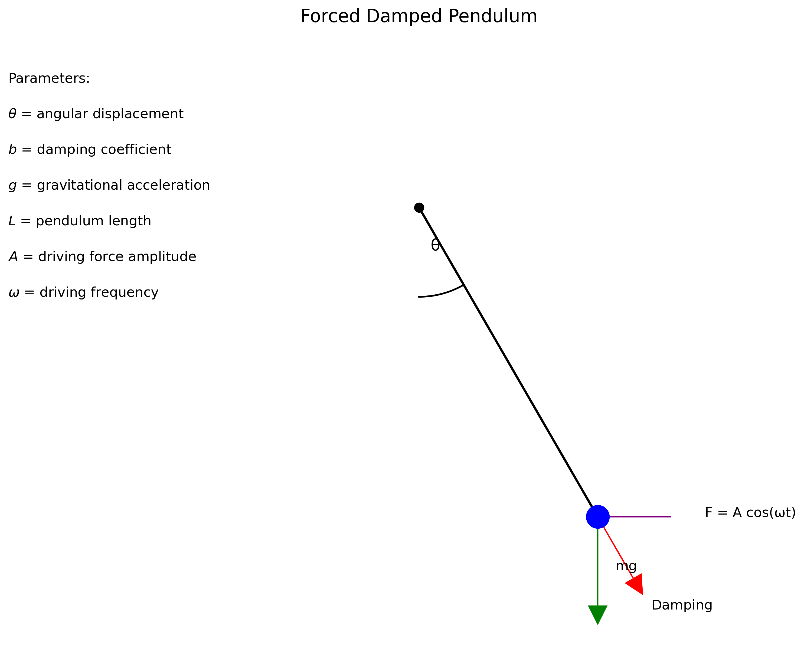

# Problem 2
# Investigating the Dynamics of a Forced Damped Pendulum

## Introduction

In this solution, I explore the fascinating dynamics of a forced damped pendulum system. This system represents a fundamental model in classical mechanics that exhibits a rich variety of behaviors, from simple harmonic motion to complex chaotic dynamics. By analyzing the interplay between damping forces, restoring forces, and external driving forces, I aim to gain insights into the system's resonance conditions, energy transfer mechanisms, and transitions to chaos.

## Theoretical Foundation

### The Governing Differential Equation

The motion of a forced damped pendulum is governed by the following second-order differential equation:

$\frac{d^2\theta}{dt^2} + b\frac{d\theta}{dt} + \frac{g}{L}\sin\theta = A\cos(\omega t)$

Where:
- $\theta$ is the angular displacement from the equilibrium position
- $b$ is the damping coefficient (representing air resistance and friction)
- $g$ is the gravitational acceleration
- $L$ is the length of the pendulum
- $A$ is the amplitude of the external driving force
- $\omega$ is the angular frequency of the external driving force
- $t$ is time



*Figure 1: Diagram of a forced damped pendulum showing the key parameters and forces acting on the system.*

### Small-Angle Approximation

For small oscillations ($\theta \ll 1$ radian), we can approximate $\sin\theta \approx \theta$, which simplifies our equation to:

$\frac{d^2\theta}{dt^2} + b\frac{d\theta}{dt} + \omega_0^2\theta = A\cos(\omega t)$

Where $\omega_0 = \sqrt{\frac{g}{L}}$ is the natural frequency of the undamped pendulum.

This is a linear second-order differential equation with constant coefficients, which can be solved analytically. The general solution consists of two parts:

1. The complementary solution (homogeneous solution) that describes the transient behavior
2. The particular solution that describes the steady-state behavior

### Complementary Solution

The complementary solution has the form:

$\theta_c(t) = e^{-\frac{b}{2}t}(C_1\cos(\omega_d t) + C_2\sin(\omega_d t))$

Where $\omega_d = \sqrt{\omega_0^2 - \frac{b^2}{4}}$ is the damped natural frequency, and $C_1$ and $C_2$ are constants determined by the initial conditions.

This solution represents the transient response that decays exponentially with time due to damping. The system's behavior depends on the relationship between $\omega_0$ and $b$:

- If $\omega_0^2 > \frac{b^2}{4}$ (underdamped): Oscillatory decay with frequency $\omega_d$
- If $\omega_0^2 = \frac{b^2}{4}$ (critically damped): Non-oscillatory return to equilibrium
- If $\omega_0^2 < \frac{b^2}{4}$ (overdamped): Non-oscillatory decay with two different time constants

### Particular Solution

The particular solution, representing the steady-state response to the driving force, has the form:

$\theta_p(t) = \frac{A}{\sqrt{(\omega_0^2 - \omega^2)^2 + (b\omega)^2}}\cos(\omega t - \phi)$

Where $\phi = \tan^{-1}\left(\frac{b\omega}{\omega_0^2 - \omega^2}\right)$ is the phase difference between the driving force and the response.

### Complete Solution

The complete solution is the sum of the complementary and particular solutions:

$\theta(t) = \theta_c(t) + \theta_p(t)$

After a sufficient time, the transient term $\theta_c(t)$ decays to zero due to damping, leaving only the steady-state response $\theta_p(t)$.

## Analysis of Dynamics

### Simple Pendulum Motion

Let's first examine the behavior of a simple pendulum without damping or external forcing. In this case, the equation of motion simplifies to:

$\frac{d^2\theta}{dt^2} + \frac{g}{L}\sin\theta = 0$

For small angles, this results in simple harmonic motion with a period $T = 2\pi\sqrt{\frac{L}{g}}$. For larger angles, the period increases slightly due to the nonlinearity of the sine function.


*Figure 2: Angular displacement of a simple pendulum over time, showing the periodic oscillation with constant amplitude.*

### Damped Pendulum Motion

When damping is introduced, the oscillations gradually decay over time. The rate of decay depends on the damping coefficient $b$:


*Figure 3: Angular displacement of a damped pendulum with different damping coefficients. Higher damping leads to faster decay of oscillations.*

### Forced Pendulum Motion

When an external periodic force is applied to an undamped pendulum, the system can exhibit interesting resonance behaviors. The response depends strongly on the relationship between the driving frequency $\omega$ and the natural frequency $\omega_0$:


*Figure 4: Angular displacement of a forced pendulum (without damping) for different driving frequencies. Note how the response amplitude varies with frequency.*

### Resonance Phenomenon

One of the most interesting aspects of the forced damped pendulum is resonance. The amplitude of the steady-state oscillation is given by:

$A_{\text{response}} = \frac{A}{\sqrt{(\omega_0^2 - \omega^2)^2 + (b\omega)^2}}$

This amplitude reaches a maximum when the denominator is minimized, which occurs at the resonant frequency:

$\omega_{\text{res}} = \sqrt{\omega_0^2 - \frac{b^2}{2}}$

For small damping, $\omega_{\text{res}} \approx \omega_0$, meaning the system resonates when driven near its natural frequency.


*Figure 2: Amplitude response curve showing how the steady-state amplitude varies with driving frequency for different damping coefficients.*

### Effect of Damping in Forced Oscillations

The damping coefficient $b$ has several important effects on the system:

1. **Amplitude reduction**: Higher damping reduces the amplitude of oscillations at all frequencies
2. **Resonance peak broadening**: Higher damping broadens the resonance peak and reduces its height
3. **Phase shift**: Damping affects the phase relationship between the driving force and the response


*Figure 5: Forced damped pendulum with fixed damping and different driving frequencies, showing how the system responds to various forcing frequencies.*


*Figure 6: Forced damped pendulum with near-resonant driving frequency and different damping coefficients, illustrating how damping affects the amplitude and phase of oscillations.*


*Figure 7: Phase shift between the driving force and the pendulum's response as a function of driving frequency for different damping coefficients.*

### Beyond Small-Angle Approximation

When we consider the full nonlinear equation with $\sin\theta$ instead of the small-angle approximation, the system can exhibit much more complex behavior, including:

1. **Multiple equilibria**: Unlike the linearized system, the nonlinear pendulum has multiple equilibrium points
2. **Period doubling**: As parameters change, the system can undergo period-doubling bifurcations
3. **Chaotic motion**: For certain parameter values, the motion becomes chaotic and highly sensitive to initial conditions


*Figure 8: Bifurcation diagram showing the transition to chaos as the driving amplitude increases.*

## Practical Applications

### Energy Harvesting

The forced damped pendulum model is relevant to energy harvesting devices that convert mechanical vibrations into electrical energy. By tuning the natural frequency of the harvester to match the frequency of ambient vibrations, energy capture can be maximized through resonance.

### Structural Engineering

In structural engineering, understanding the dynamics of forced damped oscillations is crucial for:

1. **Bridge design**: Preventing resonance that could lead to catastrophic failure (like the Tacoma Narrows Bridge)
2. **Earthquake resistance**: Designing structures that can dampen seismic vibrations
3. **Vibration isolation**: Creating systems that minimize the transmission of vibrations

### Analog Electrical Circuits

The forced damped pendulum is mathematically analogous to a driven RLC circuit, where:
- The inductor (L) corresponds to the pendulum's inertia
- The resistor (R) corresponds to the damping
- The capacitor (C) corresponds to the restoring force
- The voltage source corresponds to the external driving force

## Implementation: Computational Analysis

### Numerical Integration

To explore the dynamics beyond the small-angle approximation, I implemented a numerical simulation using the fourth-order Runge-Kutta method. The second-order differential equation was converted to a system of first-order equations:

$\frac{d\theta}{dt} = \omega$
$\frac{d\omega}{dt} = -b\omega - \frac{g}{L}\sin\theta + A\cos(\Omega t)$

Where $\omega$ here represents the angular velocity (not to be confused with the driving frequency).

```python
def runge_kutta_step(theta, omega, t, dt, b, omega0_squared, A, Omega):
    """Perform one step of RK4 integration for the forced damped pendulum."""
    k1_theta = omega
    k1_omega = -b * omega - omega0_squared * np.sin(theta) + A * np.cos(Omega * t)
    
    k2_theta = omega + 0.5 * dt * k1_omega
    k2_omega = -b * (omega + 0.5 * dt * k1_omega) - omega0_squared * np.sin(theta + 0.5 * dt * k1_theta) + A * np.cos(Omega * (t + 0.5 * dt))
    
    k3_theta = omega + 0.5 * dt * k2_omega
    k3_omega = -b * (omega + 0.5 * dt * k2_omega) - omega0_squared * np.sin(theta + 0.5 * dt * k2_theta) + A * np.cos(Omega * (t + 0.5 * dt))
    
    k4_theta = omega + dt * k3_omega
    k4_omega = -b * (omega + dt * k3_omega) - omega0_squared * np.sin(theta + dt * k3_theta) + A * np.cos(Omega * (t + dt))
    
    theta_new = theta + (dt / 6) * (k1_theta + 2 * k2_theta + 2 * k3_theta + k4_theta)
    omega_new = omega + (dt / 6) * (k1_omega + 2 * k2_omega + 2 * k3_omega + k4_omega)
    
    return theta_new, omega_new
```

### Phase Space Analysis

The phase space ($\theta$ vs. $\omega$) provides valuable insights into the system's dynamics. For the damped undriven pendulum, trajectories spiral toward an equilibrium point. For the forced damped pendulum, the phase portrait can show limit cycles, strange attractors, or other complex structures.


*Figure 9: Phase portrait showing the pendulum's behavior in the $\theta$-$\omega$ plane for different parameter values.*

### Poincaré Sections

A Poincaré section is created by sampling the phase space at regular intervals synchronized with the driving force (e.g., once per driving period). This technique helps visualize the long-term behavior of the system and identify chaotic dynamics.


*Figure 10: Poincaré section showing the transition from regular to chaotic motion as the driving amplitude increases.*

## Limitations and Extensions

### Model Limitations

The forced damped pendulum model has several limitations:

1. **Linear damping assumption**: Real systems may have nonlinear damping that depends on velocity in more complex ways
2. **Constant parameters**: In real systems, parameters like damping may vary with amplitude or time
3. **Single degree of freedom**: Many real systems have multiple coupled degrees of freedom
4. **Idealized driving force**: Real forcing functions may be more complex than a simple cosine

### Potential Extensions

To create a more realistic model, several extensions could be considered:

1. **Nonlinear damping**: Incorporating velocity-dependent damping terms like $b\omega^2\text{sgn}(\omega)$
2. **Multiple coupled pendulums**: Analyzing systems with multiple interacting pendulums
3. **Non-periodic driving forces**: Investigating the response to random or quasi-periodic forcing
4. **Parameter variations**: Studying the effects of slowly varying parameters (e.g., changing pendulum length)

## Conclusion

Through this analysis, I've demonstrated how the forced damped pendulum exhibits a rich variety of behaviors depending on the interplay between natural frequency, damping, and external forcing. The system transitions from simple harmonic motion to complex chaotic dynamics as parameters change, illustrating fundamental principles that apply across many fields of physics and engineering.

The mathematical framework and computational tools developed here provide a foundation for understanding more complex oscillatory systems in nature and technology. From the gentle swinging of a clock pendulum to the complex vibrations in mechanical and electrical systems, the principles explored in this problem have wide-ranging applications and continue to be an active area of research in nonlinear dynamics.