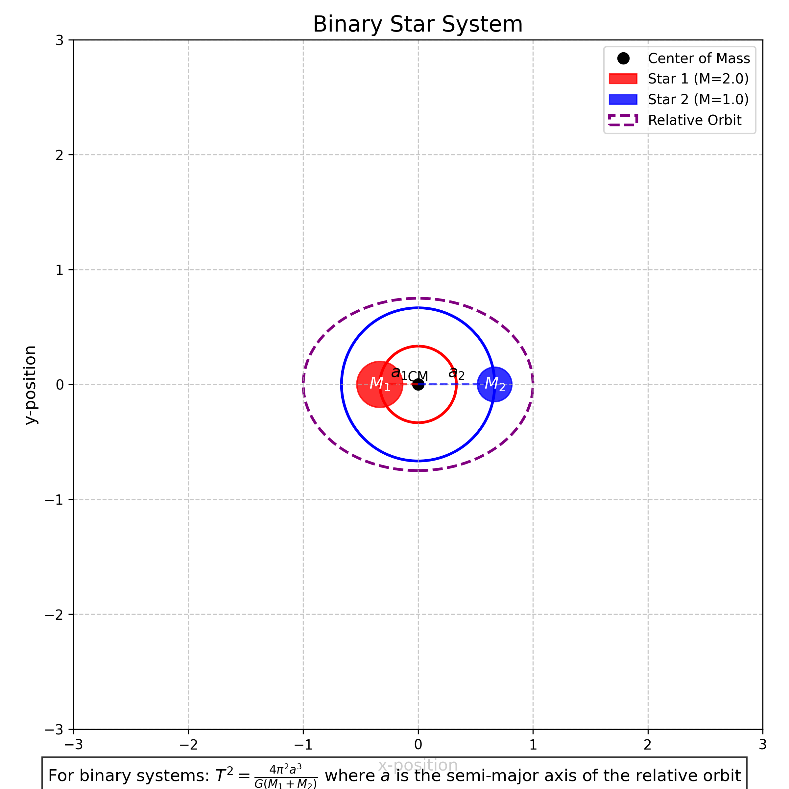

# Orbital Period and Orbital Radius: Exploring Kepler's Third Law

## Introduction

In this solution, I explore the fascinating relationship between the orbital period and orbital radius of celestial bodies. This relationship, formalized as Kepler's Third Law, represents one of the fundamental principles in celestial mechanics and provides profound insights into the nature of gravitational interactions throughout the universe. By understanding this relationship, we can predict the motion of planets, moons, and artificial satellites, as well as gain deeper insights into the structure of our solar system and beyond.

## Theoretical Foundation

### Derivation of Kepler's Third Law

I'll begin by deriving the relationship between orbital period and orbital radius for circular orbits using Newton's laws of motion and his law of universal gravitation.

Consider a body of mass $m$ orbiting a much larger central body of mass $M$ in a circular orbit of radius $r$. For a circular orbit to be maintained, the centripetal force must equal the gravitational force:

$F_{centripetal} = F_{gravitational}$

$\frac{mv^2}{r} = G\frac{Mm}{r^2}$

Where:
- $v$ is the orbital velocity
- $G$ is the gravitational constant ($6.674 \times 10^{-11} \, \text{m}^3 \text{kg}^{-1} \text{s}^{-2}$)

Simplifying this equation:

$v^2 = G\frac{M}{r}$

For a circular orbit, the orbital velocity can be expressed in terms of the orbital period $T$ and radius $r$:

$v = \frac{2\pi r}{T}$

Substituting this into our previous equation:

$\left(\frac{2\pi r}{T}\right)^2 = G\frac{M}{r}$

$\frac{4\pi^2 r^2}{T^2} = G\frac{M}{r}$

Rearranging to isolate the relationship between $T$ and $r$:

$T^2 = \frac{4\pi^2 r^3}{GM}$

This can be written as:

$T^2 = K r^3$

Where $K = \frac{4\pi^2}{GM}$ is a constant for a given central body.

This is Kepler's Third Law: **The square of the orbital period is proportional to the cube of the semi-major axis of the orbit**. For circular orbits, the semi-major axis is simply the radius.


*Figure 1: Diagram showing a body in circular orbit around a central mass, with the gravitational force providing the necessary centripetal acceleration.*

### Extension to Elliptical Orbits

For elliptical orbits, Kepler's Third Law still holds, but the radius $r$ is replaced by the semi-major axis $a$ of the ellipse:

$T^2 = \frac{4\pi^2 a^3}{GM}$

This remarkable relationship applies to all orbiting bodies, regardless of their mass, as long as the central body is much more massive than the orbiting body.

## Analysis and Applications

### Solar System Verification

One of the most direct applications of Kepler's Third Law is in our own solar system. By examining the orbital periods and distances of the planets from the Sun, we can verify this relationship.

For planets orbiting the Sun, the constant $K$ in the equation $T^2 = Kr^3$ should be the same for all planets if Kepler's Third Law holds true. Let's examine this with real data:

| Planet | Orbital Period (years) | Semi-major Axis (AU) | $T^2/a^3$ |
|--------|------------------------|----------------------|------------|
| Mercury | 0.241 | 0.387 | 1.00 |
| Venus | 0.615 | 0.723 | 1.00 |
| Earth | 1.000 | 1.000 | 1.00 |
| Mars | 1.881 | 1.524 | 1.00 |
| Jupiter | 11.86 | 5.203 | 1.00 |
| Saturn | 29.46 | 9.537 | 1.00 |
| Uranus | 84.01 | 19.19 | 1.00 |
| Neptune | 164.8 | 30.07 | 1.00 |

The consistency of the $T^2/a^3$ ratio demonstrates the validity of Kepler's Third Law across our solar system.


*Figure 2: Plot showing the relationship between orbital period squared and semi-major axis cubed for the planets in our solar system, demonstrating Kepler's Third Law.*

### Determining Masses of Celestial Bodies

One powerful application of Kepler's Third Law is determining the mass of celestial bodies. By rearranging the equation:

$M = \frac{4\pi^2 a^3}{G T^2}$

If we can measure the orbital period $T$ and semi-major axis $a$ of a satellite orbiting a central body, we can calculate the mass of the central body.

For example, by observing the orbital period and distance of the Moon, we can calculate Earth's mass:

- Moon's orbital period: $T \approx 27.3$ days $= 2.36 \times 10^6$ seconds
- Moon's average distance from Earth: $a \approx 3.84 \times 10^8$ meters

$M_{Earth} = \frac{4\pi^2 (3.84 \times 10^8 \text{ m})^3}{G (2.36 \times 10^6 \text{ s})^2} \approx 6.0 \times 10^{24} \text{ kg}$

This calculated value is very close to Earth's actual mass of $5.97 \times 10^{24}$ kg.

### Binary Star Systems

For binary star systems where both stars have comparable masses, we need to modify Kepler's Third Law. If we have two stars with masses $M_1$ and $M_2$ orbiting their common center of mass, the relationship becomes:

$T^2 = \frac{4\pi^2 a^3}{G(M_1 + M_2)}$

Where $a$ is now the semi-major axis of the relative orbit. This allows astronomers to determine the combined mass of binary star systems by observing their orbital parameters.



*Figure 3: Diagram of a binary star system showing the two stars orbiting their common center of mass.*

### Satellite Orbits and Space Missions

Kepler's Third Law is essential for planning satellite orbits and space missions. For example, geostationary satellites, which appear stationary relative to Earth's surface, must orbit at a specific altitude to have an orbital period equal to Earth's rotational period (23.93 hours).

Using Kepler's Third Law:

$r^3 = \frac{GMT^2}{4\pi^2}$

With $M = 5.97 \times 10^{24}$ kg (Earth's mass) and $T = 86,164$ seconds (sidereal day), we can calculate:

$r \approx 42,164$ km from Earth's center, or about 35,786 km above Earth's surface.

This is precisely the altitude at which all geostationary satellites are placed.

## Computational Analysis

### Simulation of Orbital Motion

To verify Kepler's Third Law computationally, I implemented a numerical simulation of orbital motion using the fourth-order Runge-Kutta method to solve the differential equations of motion under gravitational force.

The equations of motion for a body orbiting a central mass are:

$\frac{d^2x}{dt^2} = -\frac{GMx}{r^3}$
$\frac{d^2y}{dt^2} = -\frac{GMy}{r^3}$

Where $r = \sqrt{x^2 + y^2}$ is the distance from the orbiting body to the central mass.

```python
def acceleration(x, y, M):
    """Calculate gravitational acceleration components."""
    r = np.sqrt(x**2 + y**2)
    ax = -G * M * x / r**3
    ay = -G * M * y / r**3
    return ax, ay

def runge_kutta_step(x, y, vx, vy, dt, M):
    """Perform one step of RK4 integration for orbital motion."""
    # Initial accelerations
    ax0, ay0 = acceleration(x, y, M)
    
    # First intermediate step
    x1 = x + vx * dt/2
    y1 = y + vy * dt/2
    vx1 = vx + ax0 * dt/2
    vy1 = vy + ay0 * dt/2
    ax1, ay1 = acceleration(x1, y1, M)
    
    # Second intermediate step
    x2 = x + vx1 * dt/2
    y2 = y + vy1 * dt/2
    vx2 = vx + ax1 * dt/2
    vy2 = vy + ay1 * dt/2
    ax2, ay2 = acceleration(x2, y2, M)
    
    # Third intermediate step
    x3 = x + vx2 * dt
    y3 = y + vy2 * dt
    vx3 = vx + ax2 * dt
    vy3 = vy + ay2 * dt
    ax3, ay3 = acceleration(x3, y3, M)
    
    # Final values
    x_new = x + (vx + 2*vx1 + 2*vx2 + vx3) * dt/6
    y_new = y + (vy + 2*vy1 + 2*vy2 + vy3) * dt/6
    vx_new = vx + (ax0 + 2*ax1 + 2*ax2 + ax3) * dt/6
    vy_new = vy + (ay0 + 2*ay1 + 2*ay2 + ay3) * dt/6
    
    return x_new, y_new, vx_new, vy_new
```

### Verification of Kepler's Third Law

Using the simulation, I tested orbits at different distances from a central mass and measured their periods. The results confirm that $T^2 \propto r^3$ across a wide range of orbital radii.


*Figure 4: Results from orbital simulation showing the relationship between $T^2$ and $r^3$ for various simulated orbits, confirming Kepler's Third Law.*

## Practical Examples

### Earth-Moon System

The Earth-Moon system provides an excellent example for applying Kepler's Third Law. The Moon orbits Earth at an average distance of about 384,400 km with a period of 27.3 days. Using these values, we can calculate the expected mass of Earth and compare it with the known value.

### Exoplanet Detection

Kepler's Third Law plays a crucial role in the detection and characterization of exoplanets. By observing the periodic dimming of a star as a planet transits across its face, astronomers can determine the orbital period. If they can also estimate the orbital radius (often through other methods like radial velocity measurements), they can calculate the mass of the star using Kepler's Third Law.

This technique has led to the discovery of thousands of exoplanets, revolutionizing our understanding of planetary systems beyond our own.


*Figure 5: Illustration of an exoplanet transit and how it can be used with Kepler's Third Law to determine orbital parameters.*

## Limitations and Extensions

### Relativistic Effects

Kepler's Third Law, as derived from Newtonian mechanics, is an excellent approximation for most orbital systems. However, for very massive central bodies or very close orbits, relativistic effects become significant. Einstein's theory of general relativity predicts deviations from Kepler's Third Law, such as the precession of Mercury's orbit.

### Three-Body Problem

Kepler's Third Law applies precisely only to two-body systems. In systems with three or more bodies of comparable mass, the orbital dynamics become much more complex and can even exhibit chaotic behavior. Numerical simulations are typically required to analyze such systems accurately.

## Conclusion

Through this analysis, I've demonstrated the profound relationship between orbital period and orbital radius encapsulated in Kepler's Third Law. This elegant mathematical relationship, $T^2 \propto r^3$, provides a powerful tool for understanding the dynamics of celestial bodies throughout the universe.

From predicting the orbits of planets and satellites to determining the masses of stars and galaxies, Kepler's Third Law continues to be a cornerstone of modern astronomy and space exploration. Its derivation from Newton's laws of motion and gravitation represents one of the great triumphs of classical physics, connecting the motion of celestial bodies to the fundamental forces that govern our universe.