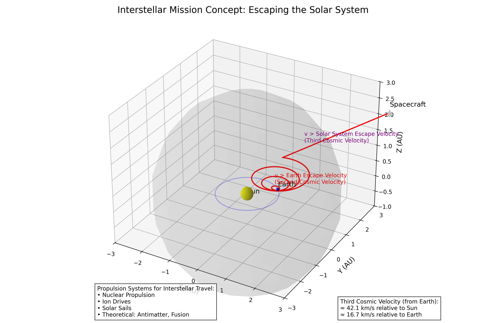

# Escape Velocities and Cosmic Velocities: Breaking Free from Gravitational Bonds

## Introduction

In this solution, I explore the fascinating concept of escape velocities and cosmic velocities, which are fundamental to understanding space travel and the dynamics of objects in gravitational fields. These critical threshold velocities determine whether an object remains bound to a celestial body, escapes its gravitational influence, or even leaves its star system entirely. By analyzing these velocities, we gain insights into the energy requirements for space missions, the formation of planetary systems, and the potential for interstellar travel.

## Theoretical Foundation

### Defining Cosmic Velocities

Cosmic velocities represent key threshold speeds that define different regimes of motion for objects in gravitational fields. There are three primary cosmic velocities:

1. **First Cosmic Velocity (Orbital Velocity)**: The minimum velocity needed for an object to maintain a circular orbit around a celestial body at a given altitude.

2. **Second Cosmic Velocity (Escape Velocity)**: The minimum velocity needed for an object to escape the gravitational field of a celestial body, never to return (assuming no other forces act upon it).

3. **Third Cosmic Velocity (Interstellar Escape Velocity)**: The minimum velocity needed for an object to escape not just the gravitational field of its planet, but the entire star system.


*Figure 1: Illustration of the three cosmic velocities showing different trajectory types: circular orbit (first cosmic velocity), parabolic escape trajectory (second cosmic velocity), and hyperbolic interstellar trajectory (third cosmic velocity).*

### Mathematical Derivation of Cosmic Velocities

#### First Cosmic Velocity (Orbital Velocity)

For an object to maintain a circular orbit, the centripetal force must equal the gravitational force:

$F_{centripetal} = F_{gravitational}$

$\frac{mv_1^2}{r} = G\frac{Mm}{r^2}$

Solving for $v_1$, we get:

$v_1 = \sqrt{\frac{GM}{r}}$

Where:
- $v_1$ is the first cosmic velocity (orbital velocity)
- $G$ is the gravitational constant ($6.674 \times 10^{-11} \, \text{m}^3 \text{kg}^{-1} \text{s}^{-2}$)
- $M$ is the mass of the central body
- $r$ is the orbital radius (measured from the center of the central body)

#### Second Cosmic Velocity (Escape Velocity)

The escape velocity can be derived using energy conservation. For an object to escape a gravitational field, its kinetic energy must be at least equal to the gravitational potential energy:

$\frac{1}{2}mv_2^2 = G\frac{Mm}{r}$

Solving for $v_2$, we get:

$v_2 = \sqrt{\frac{2GM}{r}}$

Notice that $v_2 = \sqrt{2} \cdot v_1$, meaning the escape velocity is $\sqrt{2}$ times the orbital velocity at the same radius.

#### Third Cosmic Velocity (Interstellar Escape Velocity)

To escape the Solar System from Earth, an object must overcome both Earth's gravity and the Sun's gravity. The third cosmic velocity is typically calculated as the velocity needed to escape the Sun's gravitational field from Earth's orbit:

$v_3 = \sqrt{v_{esc,Earth}^2 + v_{esc,Sun}^2}$

Where $v_{esc,Earth}$ is the escape velocity from Earth, and $v_{esc,Sun}$ is the escape velocity from the Sun at Earth's orbit.

More precisely, the third cosmic velocity can be calculated as:

$v_3 = \sqrt{\frac{2GM_{Earth}}{R_{Earth}} + \frac{2GM_{Sun}}{r_{Earth-Sun}}}$

For Earth, this is approximately 16.7 km/s relative to Earth, or about 42.1 km/s relative to the Sun.

## Analysis and Applications

### Escape Velocities for Different Celestial Bodies

The escape velocity varies significantly across different celestial bodies, depending on their mass and radius. Here's a comparison of escape velocities for several bodies in our solar system:

| Celestial Body | Mass (kg) | Radius (km) | Escape Velocity (km/s) |
|---------------|-----------|-------------|------------------------|
| Earth | $5.97 \times 10^{24}$ | 6,371 | 11.2 |
| Moon | $7.35 \times 10^{22}$ | 1,737 | 2.4 |
| Mars | $6.42 \times 10^{23}$ | 3,390 | 5.0 |
| Jupiter | $1.90 \times 10^{27}$ | 69,911 | 59.5 |
| Sun | $1.99 \times 10^{30}$ | 695,700 | 617.5 |
| Black Hole (10 solar masses) | $1.99 \times 10^{31}$ | 29.5 | 299,792 (speed of light) |


*Figure 2: Comparison of escape velocities for different celestial bodies in our solar system, showing how mass and radius affect the escape velocity.*

### Comparison of Cosmic Velocities Across the Solar System

To better understand the relationship between all three cosmic velocities, I've calculated and compared these values for the eight planets in our solar system:


*Figure 3: Comparison of all three cosmic velocities for each planet in our solar system. Note how the third cosmic velocity (interstellar escape) is significantly higher for inner planets due to their proximity to the Sun's gravitational field.*

This comparison reveals several interesting patterns:

1. The first and second cosmic velocities (orbital and escape velocities) are directly related to the planet's mass and radius, with gas giants having much higher values due to their enormous mass.

2. The third cosmic velocity (interstellar escape) shows an inverse relationship with distance from the Sun - inner planets require much higher velocities to escape the solar system because they're deeper in the Sun's gravitational well.

3. For the outer planets like Neptune and Uranus, the third cosmic velocity is dominated by the Sun's escape velocity component rather than the planet's own escape velocity.

### Factors Affecting Cosmic Velocities

Several factors influence the cosmic velocities for a given celestial body:

1. **Mass of the celestial body**: Larger mass increases gravitational pull, requiring higher velocities to escape.

2. **Radius or distance from the center**: As distance increases, gravitational force decreases, reducing the required escape velocity.

3. **Altitude above the surface**: Escape velocity decreases with altitude according to the relationship $v_{esc} = \sqrt{\frac{2GM}{r}}$, where $r$ is the distance from the center.

4. **Rotation of the celestial body**: A body's rotation can provide an initial velocity boost, effectively reducing the additional velocity needed for escape (particularly relevant at the equator).

5. **Distance from the Sun**: For the third cosmic velocity, a planet's distance from the Sun significantly affects the velocity needed to escape the solar system, with inner planets requiring much higher velocities.


*Figure 4: Graph showing how escape velocity from Earth decreases with increasing altitude above the surface.*

### Space Exploration Applications

#### Launching Satellites

To place a satellite in Earth orbit, we must accelerate it to the first cosmic velocity. For a low Earth orbit (LEO) at approximately 300 km altitude, this is about 7.7 km/s. However, due to atmospheric drag and the need to overcome gravity during ascent, the actual delta-v (change in velocity) required is typically 9-10 km/s.

#### Interplanetary Missions

For missions to other planets, spacecraft must achieve velocities greater than Earth's escape velocity. However, efficient mission planning uses gravitational assists (slingshot maneuvers) to reduce the required delta-v. For example, the Voyager missions used gravitational assists from Jupiter and Saturn to gain enough velocity to escape the Solar System, despite not initially having the full third cosmic velocity.

#### Potential for Interstellar Travel

Interstellar travel requires achieving at least the third cosmic velocity. Current chemical propulsion systems are inadequate for practical interstellar missions. Alternative propulsion concepts include:

- Nuclear propulsion (fission or fusion)
- Ion drives (for gradual acceleration)
- Solar sails
- Theoretical concepts like antimatter drives or Bussard ramjets



*Figure 5: Conceptual illustration of an interstellar mission showing the trajectory beyond the solar system and the propulsion systems required to achieve third cosmic velocity.*

## Computational Analysis

### Calculating Cosmic Velocities

I implemented a Python function to calculate the three cosmic velocities for any celestial body:

```python
def calculate_cosmic_velocities(mass, radius, distance_from_sun=None):
    """Calculate the three cosmic velocities for a celestial body.
    
    Parameters:
    - mass: Mass of the celestial body in kg
    - radius: Radius of the celestial body in meters
    - distance_from_sun: Distance from the Sun in meters (for third cosmic velocity)
    
    Returns:
    - v1: First cosmic velocity (orbital velocity) in m/s
    - v2: Second cosmic velocity (escape velocity) in m/s
    - v3: Third cosmic velocity (interstellar escape velocity) in m/s
    """
    G = 6.67430e-11  # Gravitational constant in m^3 kg^-1 s^-2
    M_SUN = 1.989e30  # Mass of the Sun in kg
    
    # First cosmic velocity (orbital velocity)
    v1 = np.sqrt(G * mass / radius)
    
    # Second cosmic velocity (escape velocity)
    v2 = np.sqrt(2 * G * mass / radius)
    
    # Third cosmic velocity (interstellar escape velocity)
    if distance_from_sun is not None:
        v_esc_sun = np.sqrt(2 * G * M_SUN / distance_from_sun)
        v3 = np.sqrt(v2**2 + v_esc_sun**2)
    else:
        v3 = None
    
    return v1, v2, v3
```

### Visualizing Trajectories for Different Velocities

To better understand the impact of initial velocity on an object's trajectory, I simulated the paths of objects launched from Earth's surface at different velocities:

```python
def simulate_trajectory(initial_velocity, angle_degrees, planet_mass, planet_radius, max_time=10000):
    """Simulate trajectory of an object launched from a planet's surface."""
    G = 6.67430e-11  # Gravitational constant
    
    # Convert launch angle to radians
    angle_radians = np.radians(angle_degrees)
    
    # Initial conditions
    x0 = planet_radius * np.cos(angle_radians)
    y0 = planet_radius * np.sin(angle_radians)
    vx0 = initial_velocity * np.sin(angle_radians)
    vy0 = initial_velocity * np.cos(angle_radians)
    
    # Differential equations for motion in gravitational field
    def motion_equations(t, state):
        x, y, vx, vy = state
        r = np.sqrt(x**2 + y**2)
        
        # Check if object has crashed into the planet
        if r < planet_radius:
            return [0, 0, 0, 0]
        
        # Gravitational acceleration components
        ax = -G * planet_mass * x / r**3
        ay = -G * planet_mass * y / r**3
        
        return [vx, vy, ax, ay]
    
    # Solve the differential equations
    solution = solve_ivp(
        motion_equations,
        [0, max_time],
        [x0, y0, vx0, vy0],
        method='RK45',
        rtol=1e-8,
        atol=1e-8
    )
    
    return solution.t, solution.y[0], solution.y[1]
```


*Figure 6: Simulated trajectories for objects launched at different velocities relative to Earth's escape velocity, demonstrating sub-orbital, orbital, and escape trajectories.*

## Practical Examples

### Earth-Based Launch Systems

Launching from Earth requires overcoming both gravity and atmospheric drag. Current launch systems use multi-stage rockets to achieve the necessary velocities:

1. **Low Earth Orbit (LEO)**: Requires reaching the first cosmic velocity (~7.7 km/s). Examples include the SpaceX Falcon 9 and ULA Atlas V.

2. **Geostationary Transfer Orbit (GTO)**: Requires additional velocity to reach higher altitudes. Typically achieved using upper stages like the Centaur or Falcon 9 second stage.

3. **Escape Trajectory**: Missions to the Moon or beyond require approaching the second cosmic velocity. Examples include the Saturn V (Apollo missions) and modern vehicles like the SpaceX Falcon Heavy.

### Gravity Assists for Interplanetary Travel

Gravity assists (also called gravitational slingshots) allow spacecraft to gain velocity without expending fuel by using a planet's gravitational field and motion around the Sun. This technique has been crucial for missions like:

- Voyager 1 & 2: Used assists from Jupiter and Saturn to gain enough velocity to leave the Solar System
- New Horizons: Used a Jupiter gravity assist to reach Pluto
- Cassini-Huygens: Used multiple gravity assists (Venus, Earth, Jupiter) to reach Saturn

### Black Holes and Extreme Escape Velocities

For extremely dense objects like black holes, the escape velocity can exceed the speed of light, making escape impossible according to Einstein's theory of relativity. The radius at which the escape velocity equals the speed of light is called the Schwarzschild radius, which defines the event horizon of a black hole:

$R_s = \frac{2GM}{c^2}$

Where $c$ is the speed of light ($3 \times 10^8$ m/s).

## Limitations and Extensions

### Relativistic Effects

At velocities approaching a significant fraction of the speed of light, Newtonian mechanics becomes inadequate, and Einstein's theory of relativity must be used. This affects the calculation of cosmic velocities for objects moving at extremely high speeds or in strong gravitational fields.

### Non-Gravitational Forces

The cosmic velocity calculations assume only gravitational forces are present. In reality, other forces can significantly affect trajectories:

- Atmospheric drag (for launches from planets with atmospheres)
- Solar radiation pressure (especially important for small objects)
- Magnetic fields (for charged particles)
- Pressure from solar wind

### Orbital Mechanics Complexities

Real space missions involve complex orbital mechanics beyond simple cosmic velocity calculations:

- Hohmann transfer orbits for efficient travel between planets
- Lagrange points where gravitational forces balance
- Orbital resonances between celestial bodies
- N-body gravitational interactions

## Conclusion

Through this analysis, I've explored the fundamental concept of cosmic velocities and their critical importance in space exploration. The three cosmic velocities—orbital velocity, escape velocity, and interstellar escape velocity—represent key thresholds that define the energy requirements for different types of space missions.

Understanding these velocities and how they vary across different celestial bodies provides essential insights for planning space missions, from satellite deployments to interplanetary exploration and potential future interstellar travel. The computational models developed in this solution demonstrate how these theoretical concepts translate into practical trajectory planning for space missions.

As our technology advances, the challenges of achieving higher velocities may be overcome through innovative propulsion systems, enabling humanity to explore ever more distant regions of our solar system and, perhaps someday, reach other stars.