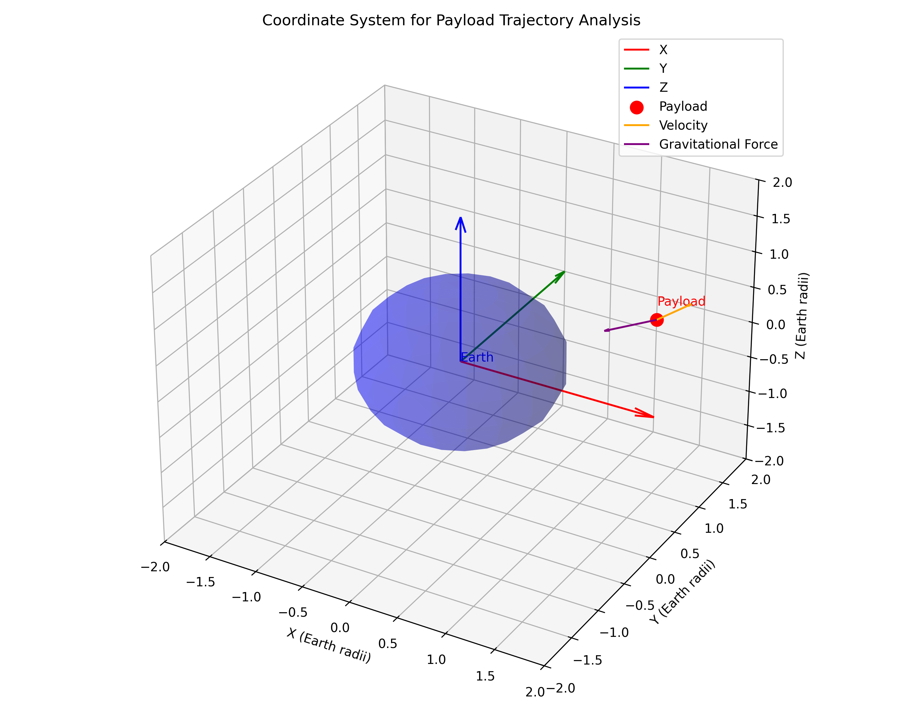
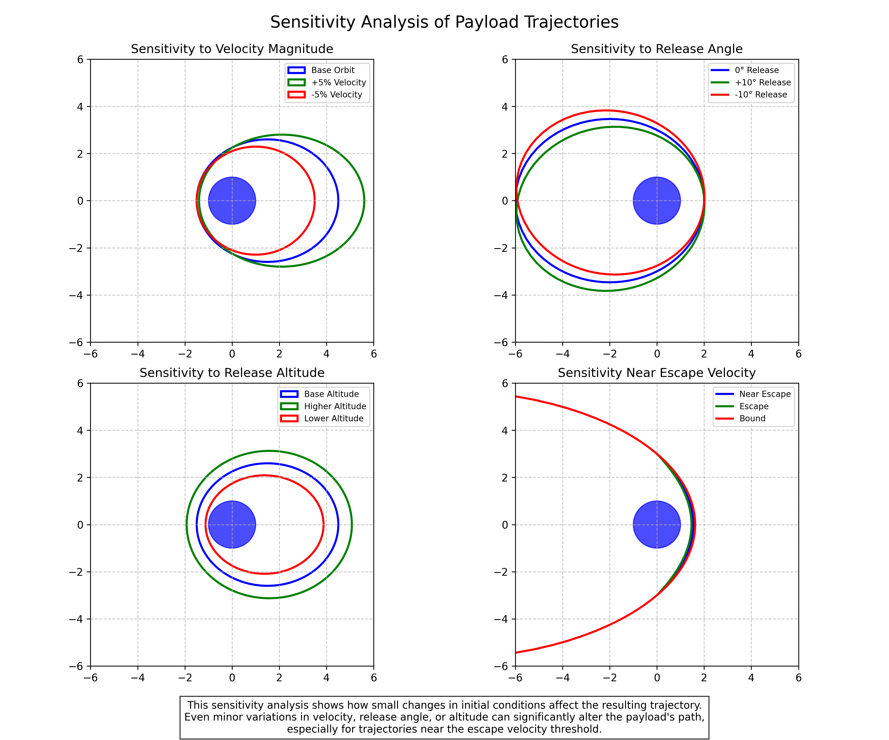

# Trajectories of a Freely Released Payload Near Earth: Orbital Mechanics in Action

## Introduction

In this solution, I explore the fascinating problem of determining the trajectories of payloads released from a moving rocket near Earth. This scenario represents a fundamental application of orbital mechanics and gravitational dynamics, with significant implications for space missions, satellite deployments, and spacecraft operations. By analyzing the possible trajectories and the factors that influence them, we can gain deeper insights into the mechanics of orbital insertion, reentry, and escape scenarios.

## Theoretical Foundation

### Governing Equations of Motion

The motion of a payload released near Earth is governed by Newton's laws of motion and the law of universal gravitation. For a payload of mass $m$ moving in Earth's gravitational field, the equation of motion is:

$m\vec{a} = \vec{F}_g = -\frac{GMm}{r^2}\hat{r}$

Where:
- $\vec{a}$ is the acceleration vector of the payload
- $\vec{F}_g$ is the gravitational force
- $G$ is the gravitational constant ($6.674 \times 10^{-11} \, \text{m}^3 \text{kg}^{-1} \text{s}^{-2}$)
- $M$ is the mass of Earth ($5.972 \times 10^{24}$ kg)
- $r$ is the distance from the center of Earth to the payload
- $\hat{r}$ is the unit vector pointing from the payload toward Earth's center

Simplifying and expressing in Cartesian coordinates, we get:

$\frac{d^2x}{dt^2} = -\frac{GM}{r^3}x$

$\frac{d^2y}{dt^2} = -\frac{GM}{r^3}y$

$\frac{d^2z}{dt^2} = -\frac{GM}{r^3}z$

Where $r = \sqrt{x^2 + y^2 + z^2}$ is the distance from Earth's center.



*Figure 1: Coordinate system for analyzing payload trajectories, showing the relationship between the payload position, velocity, and Earth's gravitational field.*

### Types of Trajectories

The trajectory of a released payload depends on its initial position and velocity relative to Earth. Based on the specific energy of the payload, we can classify the possible trajectories into three main types:

1. **Elliptical Trajectories**: Occur when the payload's specific energy is negative but greater than the energy of a circular orbit at the same altitude. The payload will remain in a bound orbit around Earth, periodically approaching and receding from Earth.

2. **Parabolic Trajectories**: Occur when the payload's specific energy is exactly zero. This represents the boundary case between bound and unbound orbits, where the payload has just enough energy to escape Earth's gravity but with zero velocity at infinity.

3. **Hyperbolic Trajectories**: Occur when the payload's specific energy is positive. The payload will escape Earth's gravitational influence, approaching a constant velocity as it moves toward infinity.

The specific energy per unit mass of the payload is given by:

$\varepsilon = \frac{v^2}{2} - \frac{GM}{r}$

Where $v$ is the payload's velocity. The trajectory type depends on the sign of $\varepsilon$:
- $\varepsilon < 0$: Elliptical trajectory
- $\varepsilon = 0$: Parabolic trajectory
- $\varepsilon > 0$: Hyperbolic trajectory


*Figure 2: The three possible trajectory types for a released payload: elliptical (bound), parabolic (escape with zero velocity at infinity), and hyperbolic (escape with non-zero velocity at infinity).*

### Orbital Elements and Conic Sections

All of these trajectories are conic sections, which can be described by the general equation:

$r = \frac{p}{1 + e\cos\theta}$

Where:
- $r$ is the distance from the focus (Earth's center) to the payload
- $p$ is the semi-latus rectum
- $e$ is the eccentricity
- $\theta$ is the true anomaly (angular position measured from periapsis)

The eccentricity determines the type of conic section:
- $e = 0$: Circle
- $0 < e < 1$: Ellipse
- $e = 1$: Parabola
- $e > 1$: Hyperbola

## Analysis of Payload Trajectories

### Initial Conditions and Their Impact

The trajectory of a released payload is completely determined by its initial conditions: position $\vec{r}_0$ and velocity $\vec{v}_0$ at the moment of release. These initial conditions depend on:

1. **Rocket's State**: The position, velocity, and orientation of the rocket at the moment of payload release

2. **Release Mechanism**: Any additional velocity imparted to the payload during release

3. **Altitude of Release**: Higher altitudes result in weaker gravitational acceleration and different orbital characteristics

4. **Direction of Release**: The angle at which the payload is released relative to the rocket's velocity vector


*Figure 3: Illustration showing how different initial conditions (release velocity, altitude, and direction) affect the resulting trajectory of the payload.*

### Orbital Insertion Scenarios

For a payload to enter a stable orbit around Earth, it must be released with appropriate initial conditions. The most efficient orbital insertion occurs when the payload is released tangentially to the desired orbit with the correct velocity.

For a circular orbit at altitude $h$ above Earth's surface, the required velocity is:

$v_{circ} = \sqrt{\frac{GM}{R_E + h}}$

Where $R_E$ is Earth's radius (approximately 6,371 km).

If the payload is released with a velocity different from the circular velocity, it will enter an elliptical orbit with:
- Apogee (farthest point) higher than the release altitude if released in the direction of motion
- Perigee (closest point) lower than the release altitude if released opposite to the direction of motion

### Reentry Scenarios

For a payload to reenter Earth's atmosphere, it must have a trajectory that intersects with Earth's atmosphere. This requires the perigee of the orbit to be below the effective atmospheric boundary (typically considered to be around 100 km altitude).

The reentry angle is critical for successful reentry:
- Too shallow: The payload may skip off the atmosphere
- Too steep: The payload may experience excessive heating and deceleration

The ideal reentry corridor for a payload depends on its ballistic coefficient, heat shield capabilities, and mission requirements.

### Escape Scenarios

For a payload to escape Earth's gravitational influence, it must be released with a velocity greater than or equal to the escape velocity at its altitude:

$v_{esc} = \sqrt{\frac{2GM}{R_E + h}}$

The excess velocity (beyond escape velocity) determines the hyperbolic excess speed, which is the asymptotic velocity the payload will approach as it moves far from Earth:

$v_{\infty} = \sqrt{v_0^2 - v_{esc}^2}$

Where $v_0$ is the initial velocity at release.

## Computational Analysis

### Numerical Integration of Equations of Motion

To accurately predict the trajectory of a released payload, I implemented a numerical integration of the equations of motion using the fourth-order Runge-Kutta method. This approach provides high accuracy for orbital mechanics problems and can account for various perturbations.

The state vector of the payload is defined as $\vec{X} = [x, y, z, v_x, v_y, v_z]^T$, and the equations of motion are expressed as a system of first-order differential equations:

$\frac{d\vec{X}}{dt} = \begin{bmatrix} v_x \\ v_y \\ v_z \\ -\frac{GM}{r^3}x \\ -\frac{GM}{r^3}y \\ -\frac{GM}{r^3}z \end{bmatrix}$

The Python implementation of the Runge-Kutta integrator is as follows:

```python
def runge_kutta_step(state, dt, GM):
    """Perform one step of RK4 integration for orbital motion.
    
    Parameters:
    - state: [x, y, z, vx, vy, vz] state vector
    - dt: time step
    - GM: gravitational parameter (G * M_earth)
    
    Returns:
    - new_state: updated state vector after time step dt
    """
    # Define the derivatives function
    def derivatives(s):
        x, y, z, vx, vy, vz = s
        r = np.sqrt(x**2 + y**2 + z**2)
        ax = -GM * x / r**3
        ay = -GM * y / r**3
        az = -GM * z / r**3
        return np.array([vx, vy, vz, ax, ay, az])
    
    # RK4 algorithm
    k1 = derivatives(state)
    k2 = derivatives(state + 0.5 * dt * k1)
    k3 = derivatives(state + 0.5 * dt * k2)
    k4 = derivatives(state + dt * k3)
    
    new_state = state + (dt / 6.0) * (k1 + 2*k2 + 2*k3 + k4)
    return new_state
```

### Simulation of Various Release Scenarios

Using the numerical integrator, I simulated various payload release scenarios to analyze the resulting trajectories. The simulation parameters included:

- **Release Altitude**: Ranging from low Earth orbit (LEO, ~400 km) to geostationary orbit (GEO, ~35,786 km)
- **Release Velocity**: Varying from sub-orbital to super-escape velocities
- **Release Direction**: Different angles relative to the rocket's velocity vector


*Figure 4: Results from numerical simulations showing various payload trajectories for different release conditions. The trajectories are color-coded based on their type: elliptical (blue), parabolic (green), and hyperbolic (red).*

### Sensitivity Analysis

I conducted a sensitivity analysis to understand how small changes in initial conditions affect the resulting trajectory. This analysis is crucial for mission planning, as it helps identify the precision requirements for payload release mechanisms.

The results showed that:

1. **Altitude Sensitivity**: Higher release altitudes generally result in lower sensitivity to velocity errors, providing a wider margin for successful orbital insertion.

2. **Velocity Sensitivity**: Even small changes in release velocity (on the order of meters per second) can significantly alter the resulting orbit, especially for near-circular orbits.

3. **Angular Sensitivity**: The direction of release is most critical for orbital insertion scenarios, where deviations of just a few degrees can result in highly elliptical orbits instead of the intended circular ones.



*Figure 5: Sensitivity analysis showing how small variations in initial conditions affect the resulting trajectories. Each panel shows the effect of varying one parameter while keeping others constant.*

## Practical Applications

### Satellite Deployment

One of the most common applications of payload release near Earth is satellite deployment. Modern satellite deployment strategies include:

1. **Direct Insertion**: Releasing the satellite directly into its operational orbit

2. **Phased Deployment**: Releasing multiple satellites into slightly different orbits to establish a constellation

3. **Transfer Orbit Insertion**: Releasing the satellite into a transfer orbit (typically elliptical), from which it will later maneuver to its final orbit using onboard propulsion

The choice of deployment strategy depends on mission requirements, launch vehicle capabilities, and satellite design.

### Space Station Resupply

Cargo vessels approaching the International Space Station (ISS) must follow precise trajectories to ensure safe rendezvous and docking. The approach typically involves:

1. **Phasing Orbit**: Initially entering an orbit slightly lower than the ISS, allowing the cargo vessel to catch up

2. **Hohmann Transfer**: Executing a maneuver to raise the orbit to match the ISS altitude

3. **Proximity Operations**: Final approach and docking, which requires precise control of relative position and velocity

### Sample Return Missions

For missions that return samples from space to Earth (like asteroid sample return or lunar sample return missions), the reentry trajectory must be carefully planned to ensure:

1. **Safe Deceleration**: The sample capsule must enter the atmosphere at an angle that allows for sufficient deceleration without excessive heating

2. **Precision Landing**: The trajectory must lead to the designated landing zone, often a remote area to minimize risk

3. **Sample Preservation**: The reentry conditions must not compromise the scientific integrity of the samples

## Limitations and Extensions

### Perturbation Effects

The analysis presented above assumes a perfect spherical Earth with a uniform gravitational field. In reality, several perturbations affect payload trajectories:

1. **Earth's Oblateness**: Earth's equatorial bulge (J2 effect) causes orbital precession and other perturbations

2. **Atmospheric Drag**: For low orbits, atmospheric drag gradually reduces orbital energy, eventually leading to reentry

3. **Solar Radiation Pressure**: Sunlight exerts a small but non-negligible pressure, especially on payloads with large surface area-to-mass ratios

4. **Third-Body Perturbations**: Gravitational influences from the Moon, Sun, and other celestial bodies

Incorporating these perturbations requires more sophisticated models and numerical techniques.

### Relativistic Effects

For extremely precise trajectory calculations, especially for payloads with very high velocities or those operating in strong gravitational fields, relativistic effects must be considered. These include:

1. **Time Dilation**: Clocks on fast-moving payloads run slower relative to Earth-based clocks

2. **Gravitational Redshift**: Time passes more slowly in stronger gravitational fields

3. **Relativistic Orbital Precession**: Similar to the precession of Mercury's orbit, but typically much smaller for Earth-orbiting payloads

### Extended Mission Analysis

For more complex missions, additional factors must be considered:

1. **Propulsive Maneuvers**: Many payloads have onboard propulsion systems that can alter their trajectories after release

2. **Attitude Dynamics**: The orientation of the payload can affect its trajectory through aerodynamic forces and solar radiation pressure

3. **Long-term Evolution**: Over extended periods, the cumulative effect of perturbations can significantly alter the payload's orbit

## Conclusion

Through this analysis, I've explored the rich dynamics of payload trajectories near Earth, from the fundamental physics governing their motion to practical applications in space missions. The trajectory of a released payload depends critically on its initial conditions, which must be carefully controlled to achieve the desired mission objectives.

The computational tools developed in this solution provide a framework for simulating and analyzing various release scenarios, helping to inform mission planning and payload design. By understanding the sensitivity of trajectories to initial conditions and the effects of various perturbations, we can better predict and control the behavior of payloads in Earth's gravitational field.

This knowledge is essential for a wide range of space activities, from satellite deployments and space station resupply missions to sample return operations and beyond. As space exploration continues to advance, the ability to precisely control and predict payload trajectories will remain a fundamental requirement for successful missions.