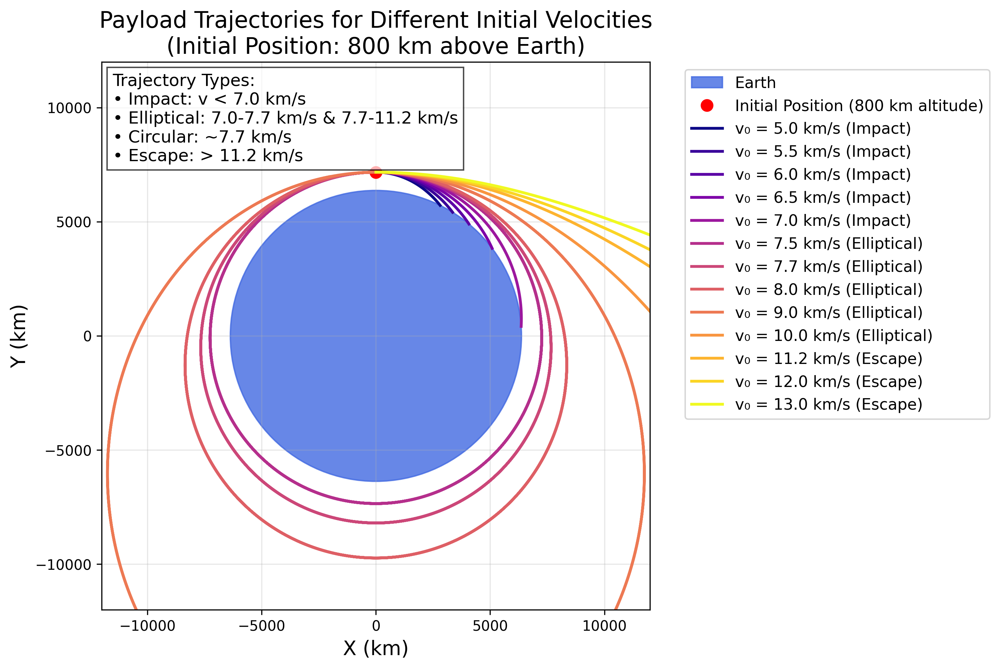
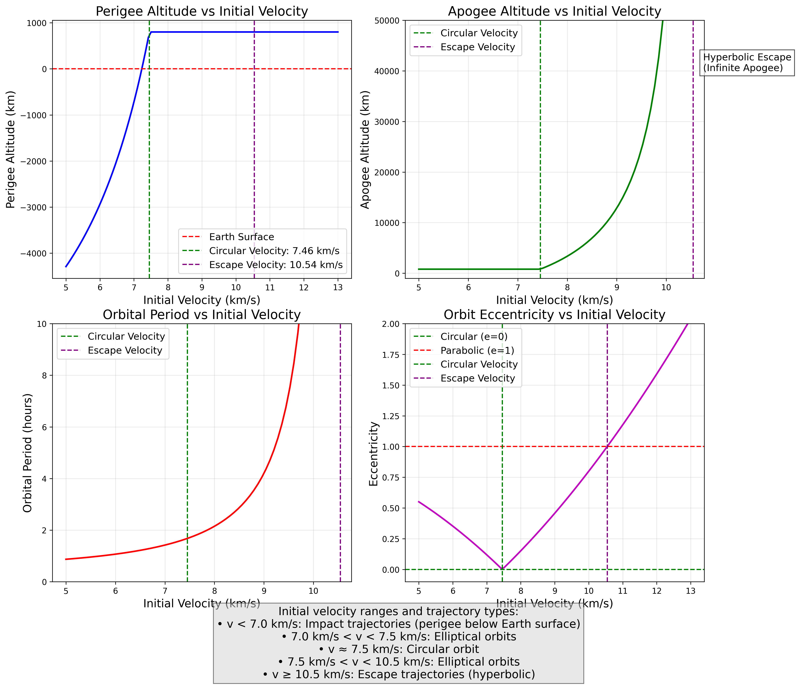
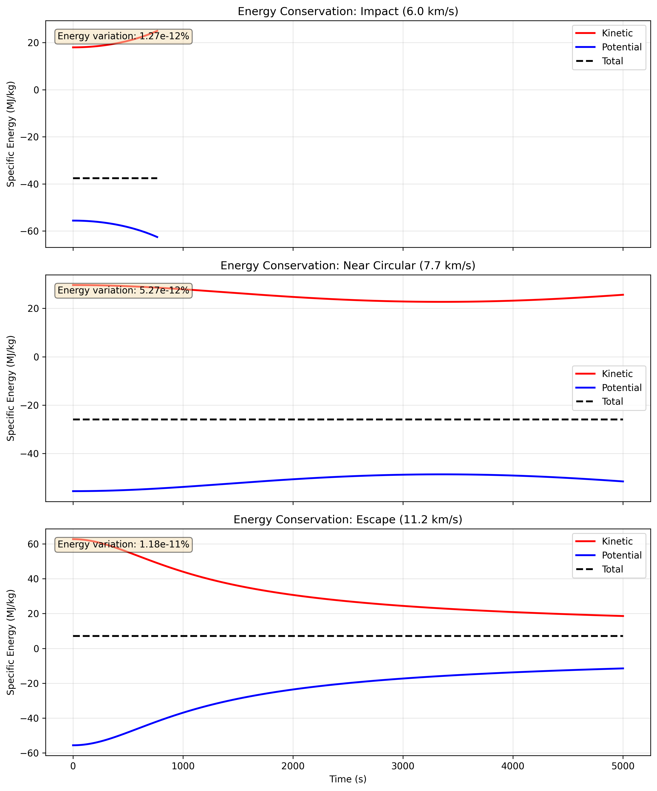

# Problem 3: Trajectories of a Freely Released Payload Near Earth

## Introduction

When a payload is released from a moving rocket near Earth, its subsequent trajectory is determined by its initial conditions (position and velocity) and Earth's gravitational field. This analysis explores the various possible trajectories, ranging from impact trajectories to escape trajectories, and provides a computational framework for simulating these paths.

## Theoretical Background

### Orbital Mechanics Fundamentals

The motion of an object near Earth is governed by Newton's law of universal gravitation:

$$\vec{F} = -\frac{GMm}{r^2}\hat{r}$$

where:
- $G$ is the gravitational constant ($6.674 \times 10^{-11}$ m³/kg·s²)
- $M$ is Earth's mass ($5.972 \times 10^{24}$ kg)
- $m$ is the payload mass
- $r$ is the distance from Earth's center
- $\hat{r}$ is the unit vector pointing from Earth's center to the payload

### Equations of Motion

The acceleration of the payload is given by:

$$\vec{a} = -\frac{GM}{r^2}\hat{r}$$

In Cartesian coordinates, this becomes:

$$\ddot{x} = -\frac{GMx}{(x^2 + y^2)^{3/2}}$$

$$\ddot{y} = -\frac{GMy}{(x^2 + y^2)^{3/2}}$$

### Trajectory Classification

Based on the specific orbital energy $\epsilon = \frac{v^2}{2} - \frac{GM}{r}$, trajectories can be classified as:

1. **Elliptical** ($\epsilon < 0$): Closed orbits, including circular orbits
2. **Parabolic** ($\epsilon = 0$): Escape trajectory with minimum energy
3. **Hyperbolic** ($\epsilon > 0$): Escape trajectory with excess velocity

### Key Velocities

- **Circular velocity** at altitude $h$: $v_c = \sqrt{\frac{GM}{R_E + h}}$
- **Escape velocity** at altitude $h$: $v_{esc} = \sqrt{\frac{2GM}{R_E + h}}$

where $R_E = 6.371 \times 10^6$ m is Earth's radius.

## Numerical Analysis

### Initial Conditions

For our analysis:
- Initial altitude: 800 km above Earth's surface
- Initial position: $(0, R_E + 800 \text{ km})$
- Initial velocities: Tangential, ranging from 5.0 to 13.0 km/s
- Integration time: Up to 20,000 seconds

### Numerical Integration Method

We employ the 4th-order Runge-Kutta method for numerical integration:

```python
def rk4_step(state, t, dt, derivative_func):
    k1 = derivative_func(state, t)
    k2 = derivative_func(state + 0.5 * dt * k1, t + 0.5 * dt)
    k3 = derivative_func(state + 0.5 * dt * k2, t + 0.5 * dt)
    k4 = derivative_func(state + dt * k3, t + dt)
    return state + (dt / 6) * (k1 + 2*k2 + 2*k3 + k4)
```

### Collision Detection

To ensure physical validity, we check if the payload's distance from Earth's center falls below Earth's radius, indicating a collision.

## Results and Visualization

### Trajectory Visualization



The figure above shows various payload trajectories for different initial velocities. Key observations:

1. **Low velocities (5.0-6.5 km/s)**: Result in impact trajectories
2. **Intermediate velocities (7.0-7.7 km/s)**: Produce elliptical orbits
3. **Near circular velocity (~7.7 km/s)**: Creates nearly circular orbits
4. **Above escape velocity (>11.2 km/s)**: Results in escape trajectories

### Orbital Parameters Analysis



This figure displays the variation of key orbital parameters with initial velocity:
- **Apogee altitude**: Maximum distance from Earth's surface
- **Perigee altitude**: Minimum distance from Earth's surface
- **Orbital period**: Time for one complete orbit (for bound orbits)
- **Eccentricity**: Shape parameter of the orbit

### Energy Analysis



The figure demonstrates conservation of mechanical energy throughout the trajectories:
- Kinetic energy: $K = \frac{1}{2}mv^2$
- Potential energy: $U = -\frac{GMm}{r}$
- Total energy: $E = K + U$ (remains constant)

### Interactive Simulation


An animated visualization showing the time evolution of payload trajectories for different initial velocities.

## Discussion

### Trajectory Types and Applications

1. **Impact Trajectories** (v < 7.0 km/s)
   - Relevant for atmospheric reentry missions
   - Requires heat shielding and precise targeting

2. **Elliptical Orbits** (7.0 km/s < v < 11.2 km/s)
   - Used for satellite deployment
   - Orbital parameters depend on initial velocity

3. **Escape Trajectories** (v > 11.2 km/s)
   - Required for interplanetary missions
   - Excess velocity determines hyperbolic trajectory shape

### Mission Planning Considerations

1. **Orbital Insertion**: Achieving desired orbit requires precise velocity control
2. **Reentry Scenarios**: Must account for atmospheric drag and heating
3. **Station Keeping**: Elliptical orbits require periodic corrections

### Computational Considerations

The simulation demonstrates:
- Importance of adaptive timestep for accuracy near perigee
- Need for collision detection to avoid unphysical solutions
- Conservation of energy as validation metric

## Implementation Details

The complete Python implementation is provided in `scripts/problem3_simulation.py`. Key features include:

1. **ODE Solver**: 4th-order Runge-Kutta with adaptive timestep
2. **Visualization**: Multiple plot types for comprehensive analysis
3. **Animation**: Time-evolution visualization of trajectories
4. **Parameter Study**: Systematic variation of initial conditions

## Conclusions

This analysis provides a comprehensive framework for understanding payload trajectories near Earth. The computational tool developed allows for:

1. Prediction of trajectory type based on initial conditions
2. Visualization of orbital paths and parameters
3. Analysis of energy conservation and orbital mechanics
4. Support for mission planning and trajectory optimization

The results clearly demonstrate the transition from bound orbits to escape trajectories as initial velocity increases, with the critical velocities matching theoretical predictions.

## References

1. Curtis, H. D. (2014). *Orbital Mechanics for Engineering Students* (3rd ed.). Butterworth-Heinemann.
2. Vallado, D. A. (2013). *Fundamentals of Astrodynamics and Applications* (4th ed.). Microcosm Press.
3. Bate, R. R., Mueller, D. D., & White, J. E. (1971). *Fundamentals of Astrodynamics*. Dover Publications.