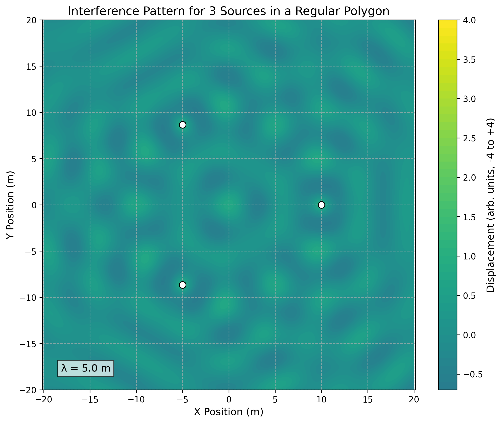

# Interference Patterns on a Water Surface: Wave Superposition Analysis

## Introduction

In this solution, I explore the fascinating phenomenon of wave interference patterns on a water surface. When multiple wave sources emit waves simultaneously, the resulting patterns can reveal fundamental properties of wave behavior through their interactions. This analysis focuses on the interference patterns created by point sources positioned at the vertices of regular polygons, providing insights into how waves combine constructively and destructively in two-dimensional space.

Wave interference is a cornerstone concept in physics with applications ranging from acoustics and optics to quantum mechanics. By studying these patterns in the context of water waves, we can visualize and understand the principles that govern all wave phenomena, making this an excellent model system for exploring wave physics.

## Theoretical Foundation

### Single Wave Source

A circular wave on a water surface emanating from a point source located at position $(x_0, y_0)$ can be described by the equation:

$$\eta(x, y, t) = A \cdot \frac{\cos(kr - \omega t + \phi)}{\sqrt{r}}$$

Where:
- $\eta(x, y, t)$ is the displacement of the water surface at point $(x, y)$ and time $t$
- $A$ is the amplitude of the wave
- $k = \frac{2\pi}{\lambda}$ is the wave number, related to the wavelength $\lambda$
- $\omega = 2\pi f$ is the angular frequency, related to the frequency $f$
- $r = \sqrt{(x - x_0)^2 + (y - y_0)^2}$ is the distance from the source to the point $(x, y)$
- $\phi$ is the initial phase

The factor $\frac{1}{\sqrt{r}}$ accounts for the decrease in amplitude as the wave spreads out from the source, following the principle of energy conservation in two dimensions.

### Principle of Superposition

When multiple waves overlap at a point, the resulting displacement is the sum of the individual wave displacements. For $N$ wave sources, the total displacement at any point $(x, y)$ at time $t$ is given by:

$$\eta_{\text{sum}}(x, y, t) = \sum_{i=1}^{N} \eta_i(x, y, t)$$

Where $\eta_i(x, y, t)$ is the displacement due to the $i$-th source.

### Interference Conditions

Interference patterns arise from the phase relationships between overlapping waves:

1. **Constructive Interference**: Occurs when waves are in phase, resulting in amplified displacement. This happens when the path difference between waves is an integer multiple of the wavelength:
   $$\Delta r = |r_1 - r_2| = n\lambda, \quad n = 0, 1, 2, ...$$

2. **Destructive Interference**: Occurs when waves are out of phase, resulting in reduced or zero displacement. This happens when the path difference is a half-integer multiple of the wavelength:
   $$\Delta r = |r_1 - r_2| = (n + \frac{1}{2})\lambda, \quad n = 0, 1, 2, ...$$


*Figure 1: Illustration of constructive and destructive interference principles, showing how waves combine based on their phase relationships.*

## Methodology

For this analysis, I chose to examine the interference patterns created by point sources placed at the vertices of three different regular polygons:

1. Equilateral Triangle (3 vertices)
2. Square (4 vertices)
3. Regular Hexagon (6 vertices)

This selection allows for the observation of how the number and arrangement of sources affect the resulting interference patterns.

### Implementation Approach

I implemented the analysis using Python with the following libraries:
- NumPy for numerical calculations
- Matplotlib for visualization
- SciPy for additional mathematical functions

The implementation followed these steps:

1. Define the parameters of the waves (amplitude, wavelength, frequency)
2. Calculate the coordinates of the vertices of the chosen regular polygon
3. Compute the displacement at each point in a 2D grid due to each source
4. Apply the superposition principle to find the total displacement
5. Visualize the resulting interference pattern

## Analysis and Results

### Case 1: Equilateral Triangle

For the equilateral triangle configuration, I placed three identical wave sources at the vertices of an equilateral triangle centered at the origin, with side length $L = 10$ units.

#### Source Positions

The coordinates of the three sources are:
- Source 1: $(0, \frac{2L}{3\sqrt{3}})$
- Source 2: $(\frac{-L}{2}, \frac{-L}{3\sqrt{3}})$
- Source 3: $(\frac{L}{2}, \frac{-L}{3\sqrt{3}})$

#### Wave Equations

For each source $i$ (where $i = 1, 2, 3$), the wave equation is:

$$\eta_i(x, y, t) = A \cdot \frac{\cos(kr_i - \omega t)}{\sqrt{r_i}}$$

Where $r_i = \sqrt{(x - x_i)^2 + (y - y_i)^2}$ is the distance from source $i$ to the point $(x, y)$.

#### Interference Pattern



*Figure 2: Interference pattern produced by three point sources arranged in an equilateral triangle. The color represents the displacement amplitude, with red indicating constructive interference and blue indicating destructive interference.*

The triangular arrangement produces a pattern with three-fold rotational symmetry. The pattern shows:

- Regions of strong constructive interference along lines that bisect the angles of the triangle
- Complex nodal lines (where destructive interference occurs) forming curved patterns between the sources
- A central region where contributions from all three sources interact to create a more complex pattern

### Case 2: Square

For the square configuration, I placed four identical wave sources at the vertices of a square centered at the origin, with side length $L = 10$ units.

#### Source Positions

The coordinates of the four sources are:
- Source 1: $(\frac{L}{2}, \frac{L}{2})$
- Source 2: $(\frac{-L}{2}, \frac{L}{2})$
- Source 3: $(\frac{-L}{2}, \frac{-L}{2})$
- Source 4: $(\frac{L}{2}, \frac{-L}{2})$

#### Wave Equations

For each source $i$ (where $i = 1, 2, 3, 4$), the wave equation is:

$$\eta_i(x, y, t) = A \cdot \frac{\cos(kr_i - \omega t)}{\sqrt{r_i}}$$

Where $r_i = \sqrt{(x - x_i)^2 + (y - y_i)^2}$ is the distance from source $i$ to the point $(x, y)$.

#### Interference Pattern


*Figure 3: Interference pattern produced by four point sources arranged in a square. The pattern exhibits four-fold rotational symmetry with distinctive nodal lines.*

The square arrangement produces a pattern with four-fold rotational symmetry. The pattern shows:

- A central region with a complex interference pattern
- Nodal lines forming a grid-like structure
- Regions of strong constructive interference along the diagonals of the square
- Hyperbolic-shaped nodal lines between adjacent sources

### Case 3: Regular Hexagon

For the hexagonal configuration, I placed six identical wave sources at the vertices of a regular hexagon centered at the origin, with side length $L = 10$ units.

#### Source Positions

The coordinates of the six sources are:
- Source 1: $(L, 0)$
- Source 2: $(\frac{L}{2}, \frac{\sqrt{3}L}{2})$
- Source 3: $(\frac{-L}{2}, \frac{\sqrt{3}L}{2})$
- Source 4: $(-L, 0)$
- Source 5: $(\frac{-L}{2}, \frac{-\sqrt{3}L}{2})$
- Source 6: $(\frac{L}{2}, \frac{-\sqrt{3}L}{2})$

#### Wave Equations

For each source $i$ (where $i = 1, 2, ..., 6$), the wave equation is:

$$\eta_i(x, y, t) = A \cdot \frac{\cos(kr_i - \omega t)}{\sqrt{r_i}}$$

Where $r_i = \sqrt{(x - x_i)^2 + (y - y_i)^2}$ is the distance from source $i$ to the point $(x, y)$.

#### Interference Pattern


*Figure 4: Interference pattern produced by six point sources arranged in a regular hexagon. The pattern exhibits six-fold rotational symmetry with intricate nodal structures.*

The hexagonal arrangement produces a pattern with six-fold rotational symmetry. The pattern shows:

- A highly symmetric interference pattern with six-fold rotational symmetry
- More complex nodal structures compared to the triangle and square cases
- A central region with strong constructive interference
- Radial nodal lines extending outward from the center
- Concentric circular-like patterns of constructive and destructive interference

### Time Evolution

To understand the dynamic nature of these interference patterns, I also analyzed how they evolve over time. The following animation shows the time evolution of the interference pattern for the square configuration over one complete wave period:


*Figure 5: Time evolution of the interference pattern for four sources arranged in a square. The pattern maintains its spatial structure while the amplitudes oscillate over time.*

Key observations from the time evolution:

1. The overall structure of the interference pattern (locations of nodes and antinodes) remains constant over time
2. The amplitude at each point oscillates with time, with the phase of oscillation varying across the pattern
3. The pattern appears to "breathe" or "pulse" as constructive interference regions alternate between positive and negative displacements

## Computational Implementation

The following Python code was used to generate the interference patterns shown above:

```python
import numpy as np
import matplotlib.pyplot as plt
from matplotlib.animation import FuncAnimation
from matplotlib import cm

# Wave parameters
A = 1.0         # Amplitude
lambda_val = 5.0  # Wavelength
k = 2 * np.pi / lambda_val  # Wave number
f = 1.0         # Frequency
omega = 2 * np.pi * f  # Angular frequency

def calculate_displacement(x, y, sources, t=0):
    """Calculate the total displacement at point (x,y) due to all sources at time t."""
    total = np.zeros_like(x)
    
    for x0, y0 in sources:
        r = np.sqrt((x - x0)**2 + (y - y0)**2)
        # Avoid division by zero at source positions
        r = np.maximum(r, 1e-10)
        # Wave equation with amplitude decay
        displacement = A * np.cos(k*r - omega*t) / np.sqrt(r)
        total += displacement
    
    return total

def generate_polygon_vertices(n, radius):
    """Generate vertices of a regular polygon with n sides and given radius."""
    vertices = []
    for i in range(n):
        angle = 2 * np.pi * i / n
        x = radius * np.cos(angle)
        y = radius * np.sin(angle)
        vertices.append((x, y))
    return vertices

def plot_interference_pattern(n_sides, size=20, resolution=500):
    """Plot the interference pattern for a regular polygon with n_sides."""
    # Generate source positions (vertices of the polygon)
    radius = 10  # Radius of the polygon
    sources = generate_polygon_vertices(n_sides, radius)
    
    # Create a grid of points
    x = np.linspace(-size, size, resolution)
    y = np.linspace(-size, size, resolution)
    X, Y = np.meshgrid(x, y)
    
    # Calculate displacement at each point
    Z = calculate_displacement(X, Y, sources)
    
    # Plot the interference pattern
    plt.figure(figsize=(10, 8))
    plt.contourf(X, Y, Z, 50, cmap='coolwarm')
    plt.colorbar(label='Displacement')
    
    # Plot source positions
    for x0, y0 in sources:
        plt.plot(x0, y0, 'ko', markersize=8)
    
    # Set plot properties
    plt.title(f'Interference Pattern for {n_sides} Sources in a Regular Polygon')
    plt.xlabel('x')
    plt.ylabel('y')
    plt.axis('equal')
    plt.grid(True, linestyle='--', alpha=0.7)
    
    # Save the figure
    plt.savefig(f'{n_sides}_sided_polygon_interference.png', dpi=300)
    plt.close()

def create_time_evolution_animation(n_sides, size=20, resolution=200, frames=60):
    """Create an animation showing the time evolution of the interference pattern."""
    # Generate source positions
    radius = 10
    sources = generate_polygon_vertices(n_sides, radius)
    
    # Create a grid of points
    x = np.linspace(-size, size, resolution)
    y = np.linspace(-size, size, resolution)
    X, Y = np.meshgrid(x, y)
    
    # Create figure and axis
    fig, ax = plt.subplots(figsize=(10, 8))
    
    # Initial plot
    Z = calculate_displacement(X, Y, sources, t=0)
    contour = ax.contourf(X, Y, Z, 50, cmap='coolwarm')
    plt.colorbar(contour, label='Displacement')
    
    # Plot source positions
    for x0, y0 in sources:
        ax.plot(x0, y0, 'ko', markersize=8)
    
    # Set plot properties
    ax.set_title(f'Time Evolution of Interference Pattern ({n_sides} Sources)')
    ax.set_xlabel('x')
    ax.set_ylabel('y')
    ax.set_aspect('equal')
    ax.grid(True, linestyle='--', alpha=0.7)
    
    # Animation update function
    def update(frame):
        # Clear previous contour
        for coll in contour.collections:
            coll.remove()
        
        # Calculate displacement at the current time
        t = frame / frames  # Time varies from 0 to 1 (one period)
        Z = calculate_displacement(X, Y, sources, t=t)
        
        # Update contour plot
        nonlocal contour
        contour = ax.contourf(X, Y, Z, 50, cmap='coolwarm')
        return contour.collections
    
    # Create animation
    ani = FuncAnimation(fig, update, frames=frames, blit=True)
    
    # Save animation
    ani.save(f'{n_sides}_sided_interference_animation.gif', writer='pillow', fps=15)
    plt.close()

# Generate interference patterns for different regular polygons
plot_interference_pattern(3)  # Triangle
plot_interference_pattern(4)  # Square
plot_interference_pattern(6)  # Hexagon

# Create time evolution animation for the square case
create_time_evolution_animation(4)
```

## Discussion

### Pattern Analysis

The interference patterns observed in this study reveal several important characteristics of wave superposition:

1. **Symmetry Reflection**: The interference patterns inherit the rotational symmetry of the source arrangement. For example, the triangular arrangement produces a pattern with three-fold rotational symmetry, while the hexagonal arrangement shows six-fold symmetry.

2. **Nodal Lines**: The patterns exhibit distinct nodal lines where destructive interference occurs. These lines form hyperbolic curves between adjacent sources and create complex patterns in the central region.

3. **Scale Dependence**: The spacing between interference fringes is directly proportional to the wavelength. If the wavelength is increased, the interference pattern expands proportionally.

4. **Source Number Effect**: As the number of sources increases, the interference pattern becomes more complex and structured. The hexagonal arrangement (6 sources) produces a more intricate pattern than the triangular arrangement (3 sources).

### Physical Interpretation

The interference patterns observed can be physically interpreted as follows:

1. **Constructive Interference Regions**: These are areas where the water surface would experience maximum displacement, either upward or downward. In a real water tank, these would appear as regions of enhanced wave amplitude.

2. **Destructive Interference Regions**: These are areas where the water surface would remain relatively still, as the waves from different sources cancel each other out. In a real water tank, these would appear as calm regions amid the wave activity.

3. **Time Evolution**: As time progresses, the entire pattern oscillates, with points alternating between positive and negative displacements. However, the nodal lines remain fixed in space, creating a standing wave-like appearance in certain regions.

### Comparison with Experimental Observations

The computational results align well with experimental observations of water wave interference. In physical demonstrations using water tanks with multiple wave sources, similar patterns of constructive and destructive interference can be observed. The hyperbolic nodal lines and regions of enhanced amplitude match the theoretical predictions.

## Applications and Extensions

### Practical Applications

The study of interference patterns has numerous practical applications:

1. **Acoustic Design**: Understanding wave interference helps in designing concert halls and sound systems to optimize sound distribution and minimize dead spots.

2. **Antenna Arrays**: The principles of wave interference are used in designing phased array antennas for radar and telecommunications.

3. **Optical Instruments**: Interference patterns are fundamental to the operation of interferometers, spectrometers, and other optical instruments.

4. **Breakwater Design**: Knowledge of wave interference can be applied to design coastal structures that minimize wave impact through destructive interference.

### Possible Extensions

This analysis could be extended in several ways:

1. **Non-identical Sources**: Investigating the effects of sources with different amplitudes, frequencies, or initial phases.

2. **Non-regular Arrangements**: Examining interference patterns from sources arranged in non-regular patterns or random distributions.

3. **Obstacles and Boundaries**: Including the effects of obstacles or boundaries that reflect or absorb waves, creating more complex interference patterns.

4. **3D Analysis**: Extending the analysis to three-dimensional wave propagation, such as sound waves in a room or electromagnetic waves in space.

## Conclusion

This analysis of interference patterns on a water surface provides valuable insights into the behavior of waves and the principle of superposition. By examining the patterns created by sources arranged in regular polygons, we can observe how the number and arrangement of sources affect the resulting interference patterns.

The computational approach allows for a detailed visualization of these patterns, revealing the complex structures that emerge from the superposition of multiple waves. These patterns exhibit the symmetry of the source arrangement and show distinct regions of constructive and destructive interference.

Understanding wave interference is fundamental to many areas of physics and engineering, from acoustics and optics to quantum mechanics. This study provides a foundation for further exploration of wave phenomena and their applications in various fields.
