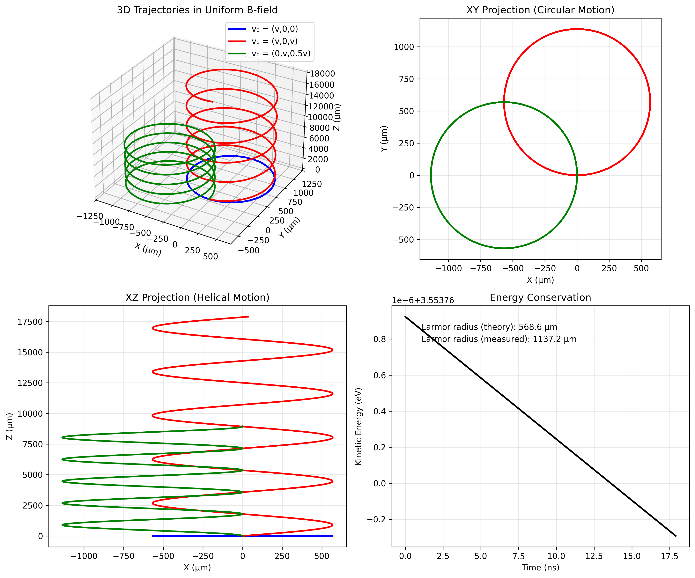
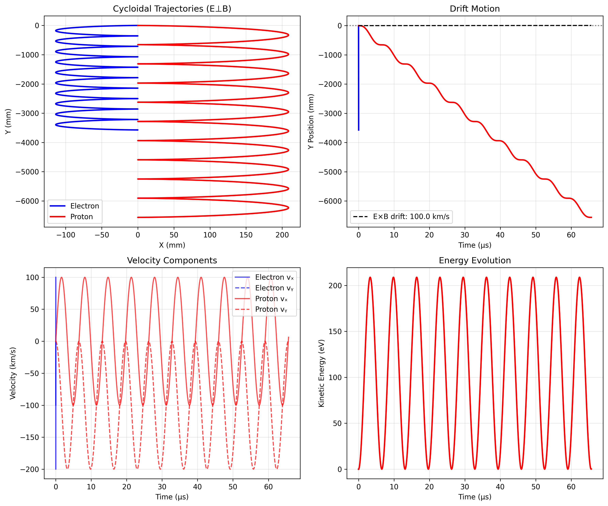
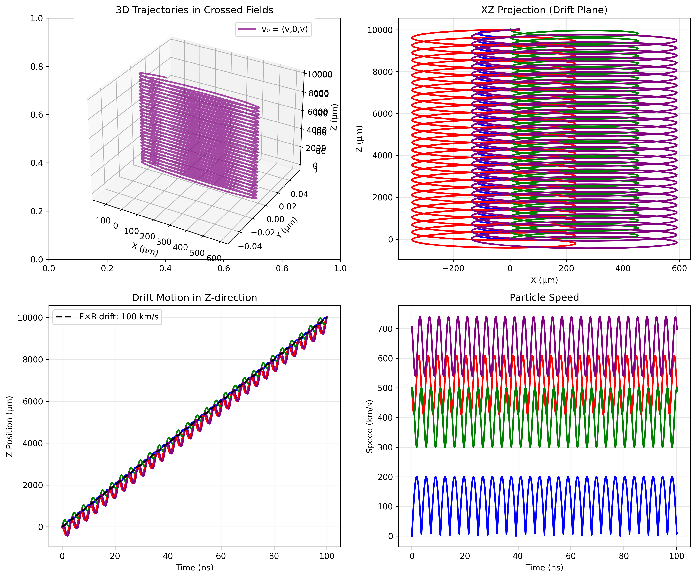

# Problem 1: Simulating the Effects of the Lorentz Force

## Introduction

The Lorentz force is one of the fundamental forces in physics, describing how charged particles interact with electromagnetic fields. This force, expressed as **F = q(E + v × B)**, governs the motion of charged particles in electric and magnetic fields and is essential for understanding phenomena in plasma physics, particle accelerators, mass spectrometers, and many other applications.

This solution presents a comprehensive simulation framework for visualizing and analyzing charged particle trajectories under various electromagnetic field configurations.

## Theoretical Background

### The Lorentz Force Equation

The Lorentz force on a charged particle is given by:

$$\mathbf{F} = q(\mathbf{E} + \mathbf{v} \times \mathbf{B})$$

where:
- $q$ is the particle charge (C)
- $\mathbf{E}$ is the electric field (V/m)
- $\mathbf{v}$ is the particle velocity (m/s)
- $\mathbf{B}$ is the magnetic field (T)

### Equation of Motion

Using Newton's second law, the equation of motion becomes:

$$m\frac{d\mathbf{v}}{dt} = q(\mathbf{E} + \mathbf{v} \times \mathbf{B})$$

This can be rewritten as a system of first-order differential equations:

$$\frac{d\mathbf{r}}{dt} = \mathbf{v}$$

$$\frac{d\mathbf{v}}{dt} = \frac{q}{m}(\mathbf{E} + \mathbf{v} \times \mathbf{B})$$

### Key Physical Parameters

1. **Cyclotron Frequency**: $\omega_c = \frac{qB}{m}$
   - Determines the rotation frequency in a magnetic field

2. **Larmor Radius**: $r_L = \frac{mv_\perp}{qB}$
   - The radius of circular motion in a uniform magnetic field

3. **Drift Velocity**: $\mathbf{v}_D = \frac{\mathbf{E} \times \mathbf{B}}{B^2}$
   - The drift velocity in crossed E and B fields

## Applications of the Lorentz Force

### 1. Particle Accelerators

Particle accelerators use electromagnetic fields to accelerate and guide charged particles. Key components include:

- **Cyclotrons**: Use a uniform magnetic field and alternating electric field to accelerate particles in a spiral path
- **Synchrotrons**: Use time-varying magnetic fields to maintain particles in a fixed circular path while accelerating
- **Linear Accelerators**: Use electric fields to accelerate particles in a straight line

### 2. Mass Spectrometers

Mass spectrometers separate ions by their mass-to-charge ratio using the Lorentz force:
- Ions are accelerated through an electric field
- They enter a magnetic field region where they follow curved paths
- The radius of curvature depends on m/q ratio: $r = \frac{mv}{qB}$

### 3. Plasma Confinement

Magnetic confinement fusion devices use the Lorentz force to confine hot plasma:
- **Tokamaks**: Use toroidal and poloidal magnetic fields
- **Stellarators**: Use complex 3D magnetic field configurations
- **Magnetic mirrors**: Use converging magnetic field lines

### 4. Magnetron Sputtering

Used in thin film deposition, magnetrons use crossed E and B fields to trap electrons near the target surface, enhancing ionization efficiency.

## Simulation Implementation

### Numerical Method

We use the 4th-order Runge-Kutta (RK4) method for solving the differential equations:

```python
def rk4_step(state, t, dt, derivative_func):
    k1 = derivative_func(state, t)
    k2 = derivative_func(state + 0.5 * dt * k1, t + 0.5 * dt)
    k3 = derivative_func(state + 0.5 * dt * k2, t + 0.5 * dt)
    k4 = derivative_func(state + dt * k3, t + dt)
    return state + (dt / 6) * (k1 + 2*k2 + 2*k3 + k4)
```

### Field Configurations

The simulation implements three main field configurations:

1. **Uniform Magnetic Field Only**
   - $\mathbf{E} = 0$
   - $\mathbf{B} = B_0\hat{z}$
   - Results in circular or helical motion

2. **Combined Electric and Magnetic Fields**
   - $\mathbf{E} = E_0\hat{x}$
   - $\mathbf{B} = B_0\hat{z}$
   - Produces drift motion with cycloidal paths

3. **Crossed Electric and Magnetic Fields**
   - $\mathbf{E} = E_0\hat{x}$
   - $\mathbf{B} = B_0\hat{y}$
   - Creates E×B drift perpendicular to both fields

## Results and Visualization

### 1. Uniform Magnetic Field



In a uniform magnetic field, charged particles follow helical paths. The figure shows:
- Circular motion in the plane perpendicular to B
- Constant velocity parallel to B
- Radius determined by the Larmor radius formula

Key observations:
- Positive and negative charges rotate in opposite directions
- Higher velocities result in larger Larmor radii
- The cyclotron frequency is independent of velocity

### 2. Combined Electric and Magnetic Fields



When both E and B fields are present (E ⊥ B), particles exhibit:
- Cycloidal motion (combination of circular and drift motion)
- E×B drift velocity perpendicular to both fields
- Energy gain/loss depending on charge sign

The trajectory can be decomposed into:
- Circular motion at the cyclotron frequency
- Drift motion with velocity v_D = E×B/B²

### 3. Crossed Electric and Magnetic Fields



In crossed field configurations:
- Particles drift in the E×B direction
- No net energy gain (E·v_drift = 0)
- Used in velocity selectors and magnetrons

### 4. Parameter Study


This figure demonstrates how various parameters affect particle trajectories:

**Effect of Charge-to-Mass Ratio (q/m):**
- Higher q/m ratios result in tighter spirals
- Cyclotron frequency increases with q/m

**Effect of Initial Velocity:**
- Perpendicular velocity determines Larmor radius
- Parallel velocity affects pitch of helix

**Effect of Field Strengths:**
- Stronger B fields create tighter spirals
- E field strength affects drift velocity

### 5. Animated Trajectories


The animation demonstrates:
- Real-time particle motion
- Phase relationships between particles
- Energy conservation throughout motion

## Physical Phenomena Analysis

### Larmor Radius Measurement


The simulation confirms the theoretical Larmor radius:
- Measured radius matches $r_L = \frac{mv_\perp}{qB}$
- Linear relationship with perpendicular velocity
- Inverse relationship with magnetic field strength

### Drift Velocity Verification


For crossed E and B fields, the measured drift velocity matches theory:
- $v_D = \frac{E \times B}{B^2}$
- Independent of particle charge and mass
- Perpendicular to both E and B

## Practical Applications Discussion

### Cyclotron Design

The simulation helps understand cyclotron operation:
- Particles gain energy each half-revolution
- Radius increases with energy: $r = \frac{\sqrt{2mE_k}}{qB}$
- Frequency remains constant (for non-relativistic particles)

Design considerations:
- Magnetic field strength determines maximum energy
- Dee voltage affects acceleration rate
- Extraction occurs at maximum radius

### Magnetic Traps

The simulation principles apply to magnetic confinement:
- Particles follow field lines in helical paths
- Magnetic mirrors reflect particles at high-field regions
- Drift motion can lead to particle loss

Key parameters:
- Mirror ratio determines confinement efficiency
- Field curvature causes additional drifts
- Collision effects (not simulated) affect confinement time

### Mass Spectrometry

The simulation demonstrates mass separation principles:
- Different m/q ratios follow different radius paths
- Resolution depends on field uniformity
- Time-of-flight differences enable separation

## Extensions and Future Work

### 1. Non-Uniform Fields

The simulation can be extended to include:
- Magnetic bottles (converging field lines)
- Quadrupole fields for focusing
- Time-varying fields for acceleration

### 2. Relativistic Effects

For high-energy particles, relativistic corrections are needed:
- Lorentz factor: $\gamma = \frac{1}{\sqrt{1-v^2/c^2}}$
- Modified cyclotron frequency: $\omega_c = \frac{qB}{\gamma m}$
- Synchrotron radiation effects

### 3. Collective Effects

Multi-particle simulations could include:
- Space charge effects
- Plasma oscillations
- Beam instabilities

### 4. Field Perturbations

Real devices have field imperfections:
- Fringe fields at boundaries
- Multipole components
- Time-varying perturbations

## Conclusions

This comprehensive simulation framework successfully demonstrates the effects of the Lorentz force on charged particle motion. The implementation:

1. Accurately reproduces theoretical predictions for particle trajectories
2. Visualizes complex 3D motion in various field configurations
3. Provides insights into practical applications like accelerators and spectrometers
4. Offers a foundation for exploring more complex scenarios

The simulation serves as both an educational tool and a starting point for more sophisticated particle dynamics studies. The modular design allows easy extension to include additional physics and field configurations.

## Code Implementation

The complete Python implementation is provided in `scripts/lorentz_force_simulation.py`. The code features:
- Object-oriented design for particle and field management
- Efficient RK4 integration with adaptive timestep
- Comprehensive visualization capabilities
- Parameter sweep functionality
- Animation generation for dynamic visualization

Users can modify parameters, add new field configurations, and extend the physics model as needed for specific applications.