# Problem 1: Exploring the Central Limit Theorem through Simulations

## Introduction

The Central Limit Theorem (CLT) is a fundamental concept in probability theory and statistics. It states that when independent random variables are added, their properly normalized sum tends toward a normal distribution even if the original variables themselves are not normally distributed. This solution explores the CLT through computational simulations, demonstrating how the sampling distribution of the sample mean approaches a normal distribution as the sample size increases.

## Methodology

The solution implements the following methodology:

1. **Population Distributions**: We generate three distinct population distributions:
   - Uniform distribution (rectangular, with equal probability across a range)
   - Exponential distribution (skewed right, modeling time between events)
   - Binomial distribution (discrete, modeling success/failure experiments)

2. **Sampling Process**: For each distribution:
   - Generate random samples of different sizes (n = 5, 10, 30, 50, 100)
   - Calculate the mean of each sample
   - Repeat the process many times (1000 iterations) to create a sampling distribution

3. **Analysis**:
   - Visualize the original population distributions
   - Plot the sampling distributions for different sample sizes
   - Create animations showing the evolution of the sampling distribution
   - Analyze the rate of convergence to normality for different distributions
   - Explore the impact of population variance on the sampling distribution

## Results and Discussion

### 1. Population Distributions

The simulation begins with three fundamentally different distributions:

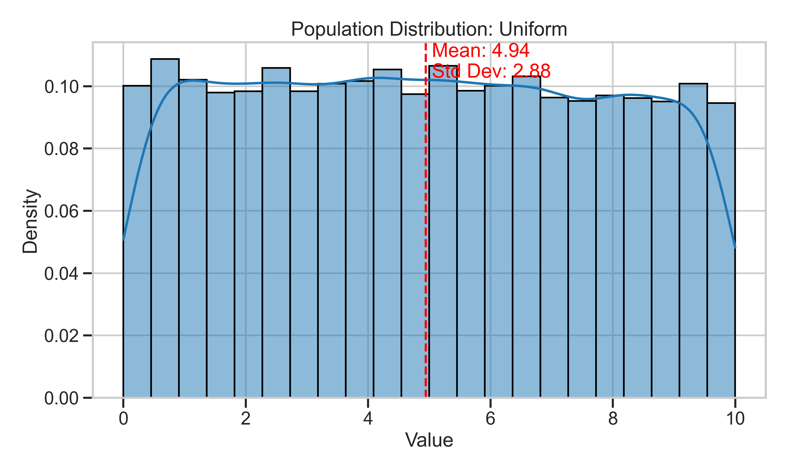
*Figure 1: Uniform distribution - characterized by constant probability across its range.*

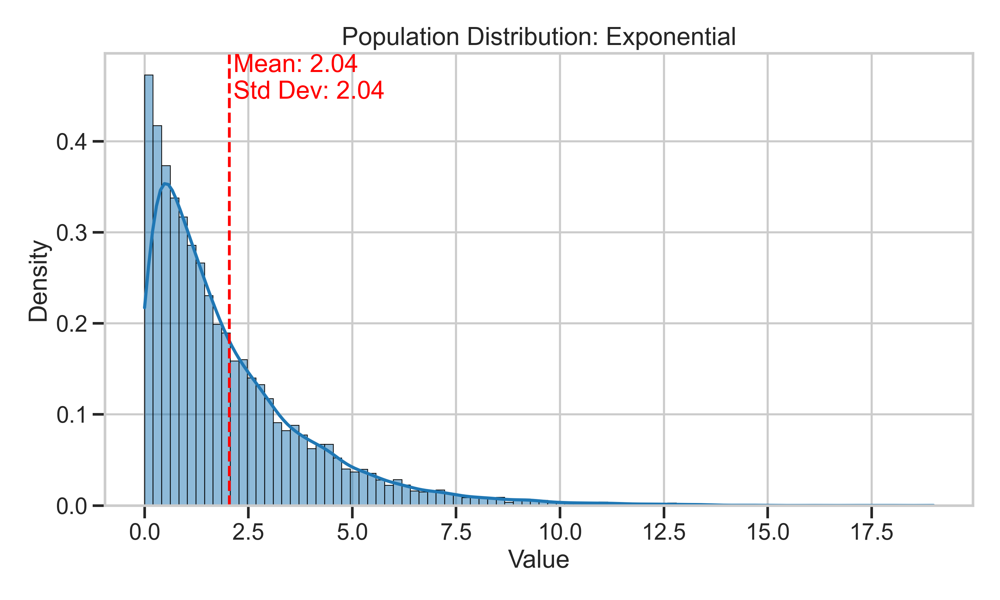
*Figure 2: Exponential distribution - heavily right-skewed with a long tail.*

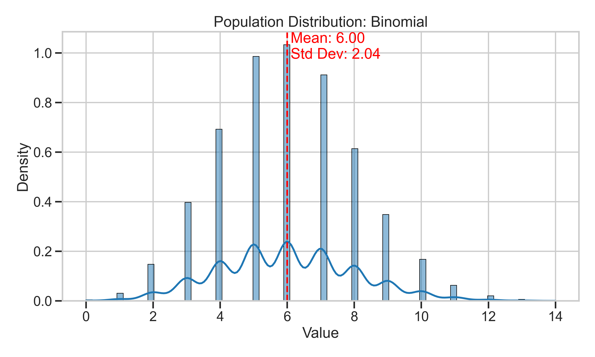
*Figure 3: Binomial distribution - discrete distribution with a peak near the mean.*

### 2. Sampling Distributions

For each population distribution, we observe how the sampling distribution of the mean evolves as sample size increases:

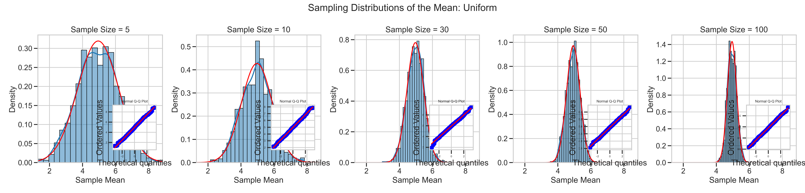
*Figure 4: Sampling distributions for the uniform population at different sample sizes.*

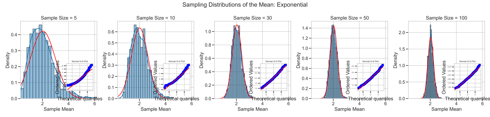
*Figure 5: Sampling distributions for the exponential population at different sample sizes.*

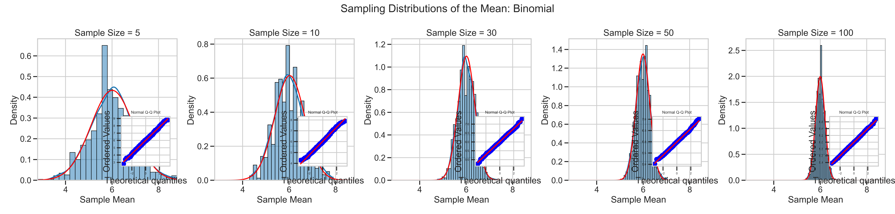
*Figure 6: Sampling distributions for the binomial population at different sample sizes.*

#### Key Observations:
- Even with a sample size as small as n=5, the sampling distributions begin to show a bell-shaped curve
- As sample size increases, the sampling distributions become increasingly normal
- The exponential distribution (most skewed) takes larger sample sizes to achieve normality compared to the others
- Q-Q plots (inset) confirm increasing normality as sample sizes grow

### 3. Sampling Distribution Evolution

The following animations demonstrate how the sampling distribution evolves as more samples are collected:

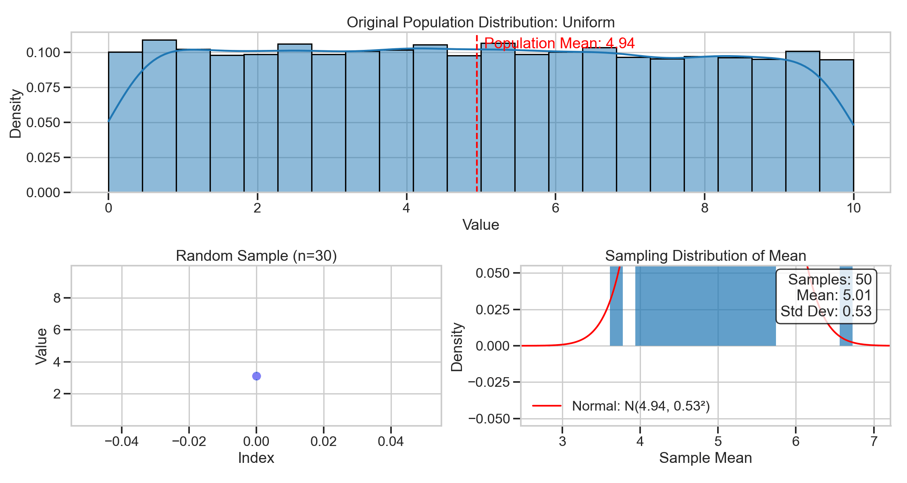
*Figure 7: Animation showing the evolution of the sampling distribution for the uniform population.*

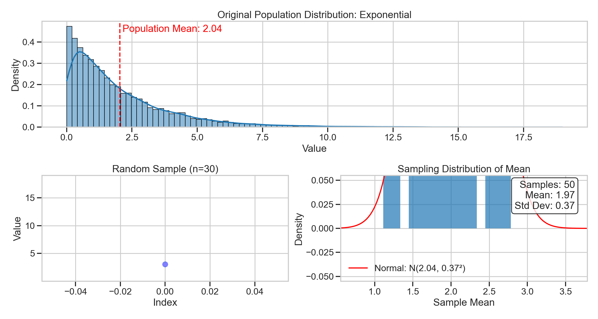
*Figure 8: Animation showing the evolution of the sampling distribution for the exponential population.*

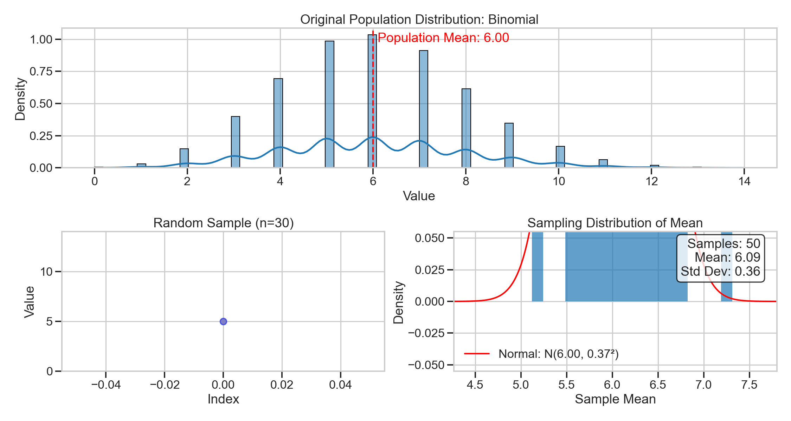
*Figure 9: Animation showing the evolution of the sampling distribution for the binomial population.*

### 4. Convergence to Normality

The convergence rate varies by distribution type:

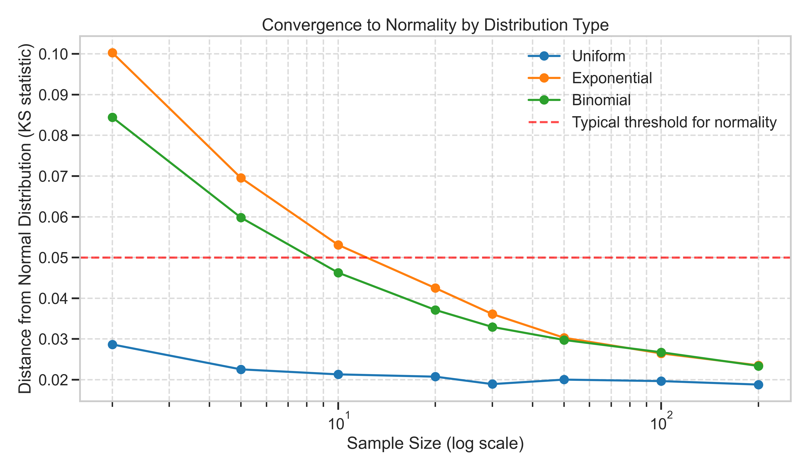
*Figure 10: Comparison of convergence rates to normality across different distributions.*

The graph uses the Kolmogorov-Smirnov test statistic as a measure of distance from normality (lower values indicate closer to normal). The exponential distribution requires larger sample sizes to achieve the same level of normality as the uniform and binomial distributions.

### 5. Impact of Population Variance

The standard error of the sampling distribution is directly related to the population standard deviation:

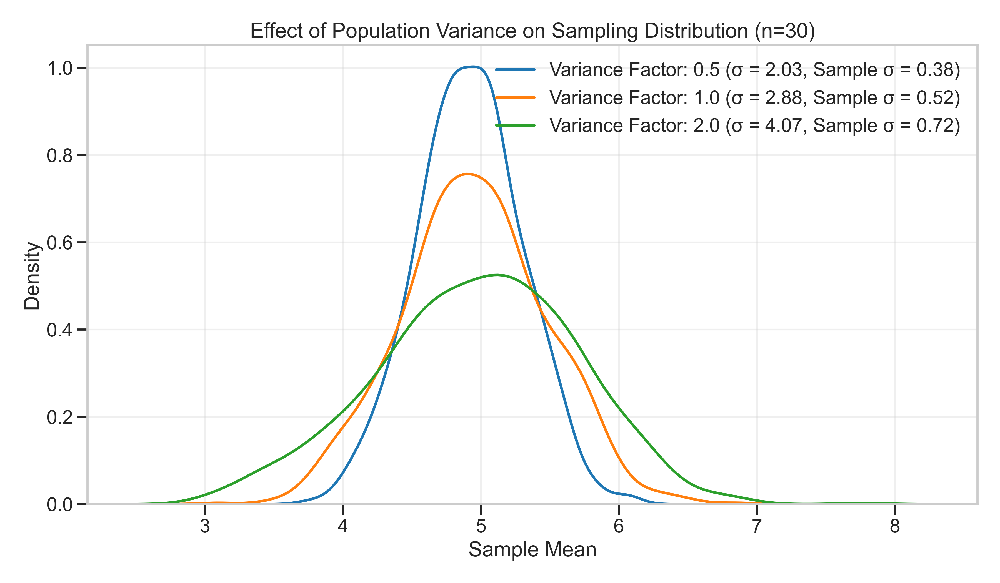
*Figure 11: Effect of population variance on the sampling distribution for the uniform distribution.*

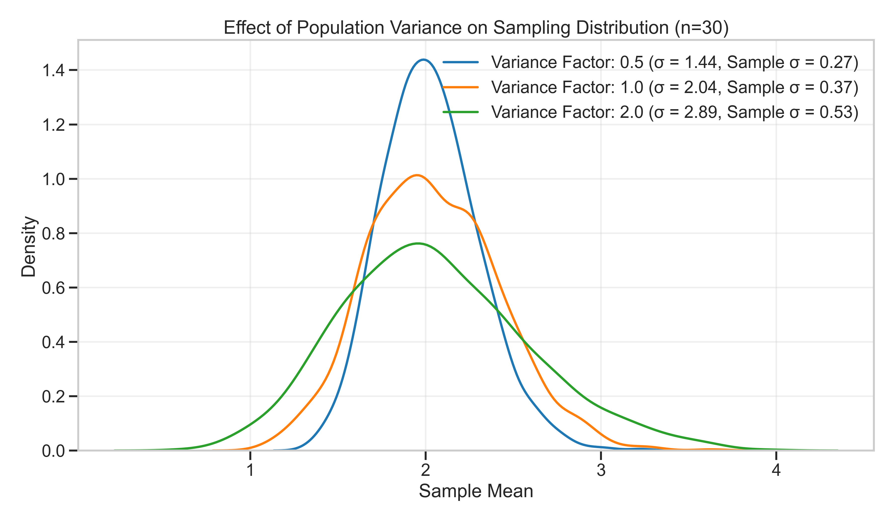
*Figure 12: Effect of population variance on the sampling distribution for the exponential distribution.*

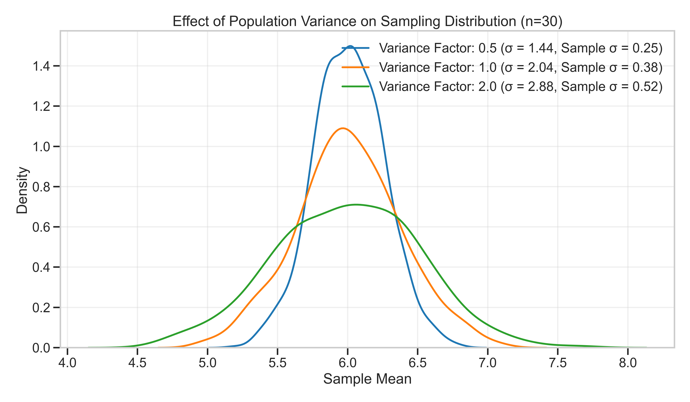
*Figure 13: Effect of population variance on the sampling distribution for the binomial distribution.*

As predicted by theory, populations with larger variance produce sampling distributions with larger spread, following the relationship:
$\sigma_{\bar{x}} = \frac{\sigma}{\sqrt{n}}$

where $\sigma_{\bar{x}}$ is the standard deviation of the sampling distribution (standard error), $\sigma$ is the population standard deviation, and $n$ is the sample size.

## Practical Applications

The Central Limit Theorem has numerous practical applications:

1. **Estimating Population Parameters**: The CLT allows us to make inferences about population parameters using sample statistics, forming the basis for confidence intervals and hypothesis testing.

2. **Quality Control**: In manufacturing, the CLT enables statistical process control methods to monitor product quality, even when the underlying processes may not be normally distributed.

3. **Financial Modeling**: Risk assessments and portfolio theory often rely on the CLT to model the aggregate behavior of many individual financial instruments.

4. **Medical Research**: When analyzing the effectiveness of treatments across multiple patients, the CLT provides the theoretical foundation for statistical significance testing.

## Conclusion

These simulations demonstrate the power and universality of the Central Limit Theorem. Regardless of the shape of the original population distribution (uniform, exponential, or binomial), the sampling distribution of the mean approaches normality as the sample size increases.

The rate of convergence depends on:
1. The initial shape of the population distribution (more skewed distributions require larger samples)
2. The sample size (larger samples produce more normal sampling distributions)
3. The population variance (affects the spread but not the shape of the sampling distribution)

This understanding of the CLT is fundamental to statistical inference and underpins many real-world applications where we need to make conclusions about populations based on limited samples.

## Implementation Notes

The simulation was implemented in Python using:
- NumPy for numerical operations and random number generation
- Matplotlib and Seaborn for static visualizations
- Matplotlib's animation module for creating animated GIFs

The complete implementation can be found in the accompanying script: `scripts/clt_simulation.py`
