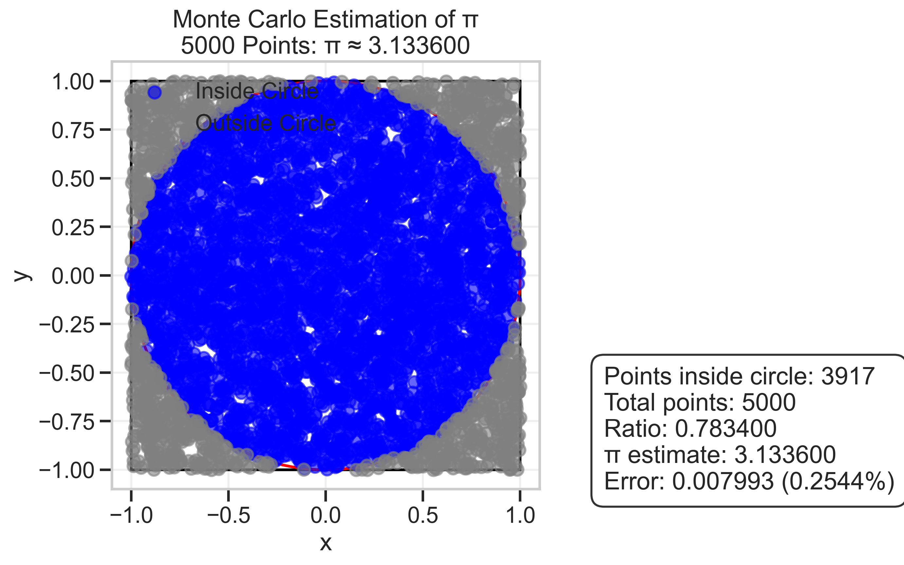
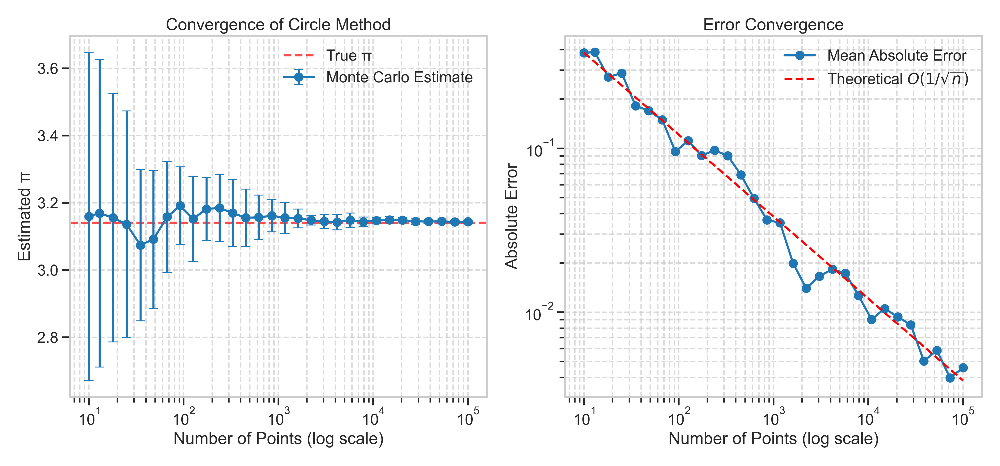
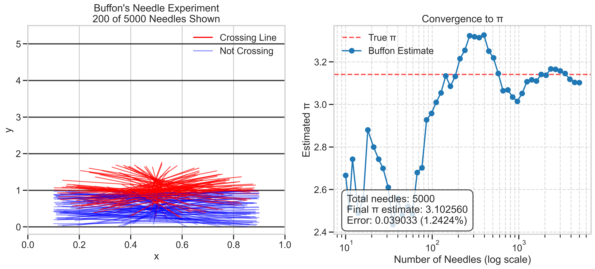

# Problem 2: Estimating Pi using Monte Carlo Methods

## Introduction

Monte Carlo methods are computational algorithms that rely on repeated random sampling to obtain numerical results. One elegant application of these methods is estimating the mathematical constant π (pi). This solution explores two distinct Monte Carlo approaches to approximating π: the circle-based method and Buffon's Needle method.

## Theoretical Foundation

### Part 1: Circle-Based Method

The circle-based approach leverages the relationship between the area of a circle and the area of its enclosing square. For a unit circle (radius = 1) inscribed within a 2×2 square:

- Area of the circle: $A_{circle} = πr^2 = π$
- Area of the square: $A_{square} = 4$
- Ratio: $\frac{A_{circle}}{A_{square}} = \frac{π}{4}$

Thus, if we randomly generate points within the square, the probability of a point falling inside the circle equals the ratio of areas:

$P(\text{point inside circle}) = \frac{A_{circle}}{A_{square}} = \frac{π}{4}$

Rearranging this equation gives us:

$π ≈ 4 \times \frac{\text{Number of points inside circle}}{\text{Total number of points}}$

### Part 2: Buffon's Needle Method

Buffon's Needle problem, first posed by Georges-Louis Leclerc, Comte de Buffon in the 18th century, offers another approach to estimating π. The problem involves dropping needles randomly onto a surface with parallel lines and calculating the probability of a needle crossing a line.

For needles of length $L$ dropped on a plane with parallel lines spaced distance $D$ apart (where $L ≤ D$), the probability of a needle crossing a line is:

$P(\text{crossing}) = \frac{2L}{πD}$

Rearranging this equation allows us to estimate π:

$π ≈ \frac{2L \times \text{Number of needles}}{D \times \text{Number of crossings}}$

## Implementation

Both methods were implemented in Python using NumPy for numerical operations and Matplotlib for visualization. The implementations include:

1. Generating random samples (points or needles)
2. Counting events (points inside the circle or needles crossing lines)
3. Calculating π estimates
4. Visualizing the results and convergence behavior

## Results and Discussion

### Circle-Based Method

*Figure 1: Monte Carlo estimation of π using the circle method. Blue points are inside the unit circle, gray points are outside.*

The circle method provides an intuitive visual representation of the process. As more points are generated, the ratio of points inside the circle to total points converges to π/4.

*Figure 2: Convergence of the circle-based method as the number of points increases.*

The left panel shows how the estimate approaches the true value of π as more points are used. The right panel confirms that the error decreases at a rate proportional to $1/\sqrt{n}$, which is characteristic of Monte Carlo methods.

### Buffon's Needle Method

*Figure 3: Buffon's Needle experiment. Red needles cross a line, blue needles do not cross any line.*

Buffon's Needle approach offers a geometrically interesting perspective on estimating π. The probability of a needle crossing a line depends on π, allowing us to estimate its value from experimental data.

*Figure 4: Convergence of Buffon's Needle method as the number of needles increases.*

Similar to the circle method, Buffon's Needle approach exhibits $1/\sqrt{n}$ convergence, though with notably higher variance, especially at lower sample sizes.

### Evolution of Estimates

*Figure 5: Animation showing the evolution of the circle method estimate as more points are added.*

The animation demonstrates how the estimate fluctuates initially but stabilizes as more points are sampled, approaching the true value of π.

*Figure 6: Evolution of Buffon's Needle method estimate as more needles are dropped.*

The static visualization shows both the physical arrangement of needles and the convergence of the estimate as the sample size increases.

### Comparison of Methods

*Figure 7: Comparison of error convergence between the two methods.*

The comparison reveals that:

1. Both methods follow the expected $1/\sqrt{n}$ error reduction rate
2. The circle method generally provides more accurate estimates with less variance
3. Buffon's Needle method exhibits higher variability, especially at lower sample sizes

## Analysis

### Convergence Rate

Both methods demonstrate the expected Monte Carlo convergence rate of $O(1/\sqrt{n})$, where $n$ is the number of samples. This means that to reduce the error by a factor of 10, approximately 100 times more samples are needed.

The empirical results confirm this theoretical expectation, as shown in the error plots where the observed errors closely follow the $1/\sqrt{n}$ trend line.

### Computational Efficiency

The circle method is computationally more efficient for several reasons:

1. Simpler calculations (only distance comparisons are needed)
2. Lower variance in estimates
3. More stable convergence, especially with smaller sample sizes

Buffon's Needle method, while mathematically elegant, requires more complex geometry calculations and exhibits higher variance in its estimates.

### Practical Considerations

For practical applications requiring π estimation (which are rare given that π is known to trillions of digits), the circle method would be preferred due to its:

1. Faster convergence to accurate estimates
2. Lower computational overhead
3. More stable behavior with smaller sample sizes

However, Buffon's Needle method provides valuable insights into geometric probability and serves as an excellent educational tool for understanding the relationship between physical processes and mathematical constants.

## Conclusion

This exploration of Monte Carlo methods for estimating π demonstrates the power and versatility of statistical simulation techniques. Both approaches—the circle method and Buffon's Needle method—successfully converge to π as the number of samples increases, following the characteristic $1/\sqrt{n}$ convergence rate of Monte Carlo methods.

The circle method generally provides more accurate and stable estimates with the same number of samples, making it the preferred approach for practical applications. However, Buffon's Needle method offers a fascinating connection between geometric probability and π, making it valuable from theoretical and educational perspectives.

These methods illustrate how randomness can be harnessed to solve deterministic problems, a counterintuitive yet powerful concept in computational mathematics. While modern computing has made these methods obsolete for calculating π itself (which is known to trillions of digits), the underlying principles remain fundamental to Monte Carlo techniques used throughout science, engineering, and finance.