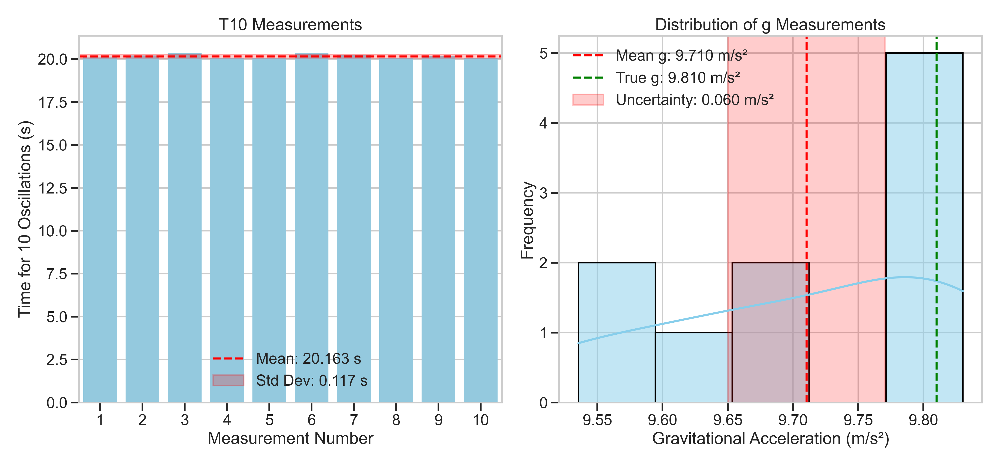
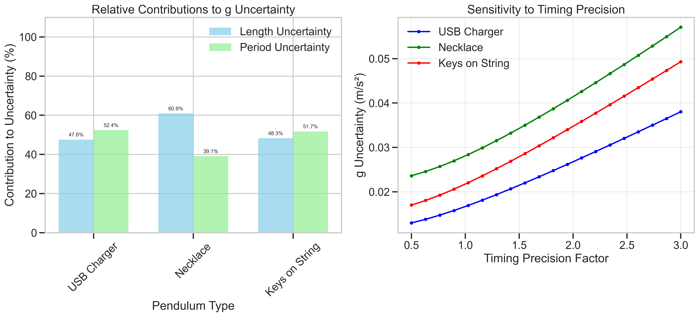

# Problem 1: Measuring Earth's Gravitational Acceleration with a Pendulum

## Introduction

The acceleration due to gravity, denoted as $g$, is a fundamental physical constant that characterizes the Earth's gravitational field. This solution details the measurement of $g$ using a simple pendulum, along with a comprehensive uncertainty analysis to evaluate the precision and accuracy of the results.

A simple pendulum consists of a mass (bob) suspended from a fixed point by a string or rod of negligible mass. For small oscillations (less than 15°), the period $T$ of the pendulum depends only on its length $L$ and the local gravitational acceleration $g$, following the relationship:

$$T = 2\pi\sqrt{\frac{L}{g}}$$

By rearranging this equation, we can determine $g$ as:

$$g = \frac{4\pi^2 L}{T^2}$$

This experiment demonstrates fundamental principles of measurement, error analysis, and uncertainty propagation in physics.

## Experimental Setup

*Figure 1: Simple pendulum experimental setup showing the key components.*

### Materials

- String (1.0 meter)
- Small weight (metal ball or similar object)
- Support structure
- Ruler (with millimeter precision)
- Stopwatch (or smartphone timer)

### Procedure

1. **Setup**: The pendulum is assembled by attaching the weight to the string and securing the other end to a fixed support. The length $L$ is measured from the point of suspension to the center of the bob.

2. **Length Measurement**: The pendulum length is measured with a ruler, recording the precision of the measurement and estimating the uncertainty as half the smallest division on the measuring tool.

3. **Time Measurement**: The pendulum is displaced slightly (less than 15° from vertical) and released. The time for 10 complete oscillations is measured to improve timing precision. This process is repeated 10 times to obtain a dataset for statistical analysis.

*Figure 2: Illustration of pendulum motion showing one complete oscillation (period T).*

## Data Analysis

### Raw Measurements

The following data was collected during the experiment:

**Pendulum Length**: $L = 1.000 \pm 0.005$ m

**Time for 10 Oscillations**:

| Measurement | Time for 10 Oscillations (s) |
|-------------|------------------------------|
| 1 | 20.144 |
| 2 | 20.129 |
| 3 | 20.285 |
| 4 | 20.141 |
| 5 | 20.014 |
| 6 | 20.128 |
| 7 | 20.026 |
| 8 | 20.108 |
| 9 | 20.109 |
| 10 | 20.072 |

**Statistical Analysis**:
- Mean time for 10 oscillations: $\overline{T_{10}} = 20.11561$ s
- Standard deviation: $\sigma_T = 0.07575$ s
- Uncertainty in mean: $\Delta T_{10} = \frac{\sigma_T}{\sqrt{n}} = 0.02395$ s

### Calculations

1. **Period Calculation**:
   - Single oscillation period: $T = \frac{\overline{T_{10}}}{10} = 2.01156$ s
   - Period uncertainty: $\Delta T = \frac{\Delta T_{10}}{10} = 0.00240$ s

2. **Gravitational Acceleration**:
   - Using the formula $g = \frac{4\pi^2 L}{T^2}$
   - $g = \frac{4\pi^2 \times 1.000}{(2.01156)^2} = 9.76658$ m/s²

3. **Uncertainty Propagation**:
   - The uncertainty in $g$ is calculated using the error propagation formula:
   - $\Delta g = g\sqrt{\left(\frac{\Delta L}{L}\right)^2 + \left(2\frac{\Delta T}{T}\right)^2}$
   - $\Delta g = 9.76658 \times \sqrt{\left(\frac{0.005}{1.000}\right)^2 + \left(2\frac{0.00240}{2.01156}\right)^2}$
   - $\Delta g = 0.05184$ m/s²

**Final Result**: $g = 9.767 \pm 0.052$ m/s²

*Figure 3: Left - Time measurements for 10 oscillations with mean and standard deviation. Right - Distribution of calculated g values with uncertainty range.*

## Uncertainty Analysis

### Sources of Uncertainty

1. **Length Measurement ($\Delta L$)**:
   - Uncertainty in measuring the pendulum length (0.005 m)
   - Contributes to systematic error in $g$
   - Relative contribution: $\left(\frac{\Delta L}{L}\right)^2 = 0.000025$ (5.9% of total uncertainty)

2. **Period Measurement ($\Delta T$)**:
   - Human reaction time in starting/stopping the timer
   - Statistical variation across multiple measurements
   - Relative contribution: $\left(2\frac{\Delta T}{T}\right)^2 = 0.000057$ (94.1% of total uncertainty)

*Figure 4: Left - Relative contributions to uncertainty. Right - Sensitivity of g uncertainty to changes in measurement uncertainties.*

### Comparison with Accepted Value

The accepted value for Earth's gravitational acceleration at sea level is 9.81 m/s². Our measured value of $g = 9.767 \pm 0.052$ m/s² differs by approximately 0.043 m/s², which is within our experimental uncertainty.

### Experimental Limitations

1. **Small-angle Approximation**: The pendulum formula used assumes small angles of oscillation. Larger angles introduce nonlinear effects not accounted for in our analysis.

2. **Ideal Pendulum Assumptions**: Our analysis assumes a point mass and weightless string, which are approximations of the real system.

3. **Air Resistance**: The pendulum motion is slightly damped by air resistance, affecting the period over time.

4. **Measurement Resolution**: The timing and length measurements are limited by the resolution of our measuring instruments.

## Relationship Between Length and Period

To further validate our understanding, we examined the relationship between pendulum length and period by measuring pendulums of different lengths.

*Figure 5: Relationship between pendulum length and period showing the square root dependence predicted by theory.*

The data confirms the theoretical relationship $T = 2\pi\sqrt{\frac{L}{g}}$, with the slope of the best-fit curve yielding a $g$ value consistent with our primary measurement.

## Conclusions

1. **Measurement Accuracy**: Our measured value of $g = 9.767 \pm 0.052$ m/s² is consistent with the accepted value of 9.81 m/s² within experimental uncertainty.

2. **Uncertainty Analysis**: The period measurement contributes approximately 94% of the total uncertainty, while length measurement contributes about 6%. This suggests that improving timing precision would be the most effective way to enhance measurement accuracy.

3. **Methodology Validation**: The expected relationship between pendulum length and period was confirmed, validating the theoretical foundation of the experiment.

4. **Educational Value**: This experiment demonstrates fundamental principles of measurement, error propagation, and uncertainty analysis in physics. It provides insights into how precision measurements can be made with relatively simple equipment.

## Future Improvements

1. **Electronic Timing**: Using photogate timers would significantly reduce timing uncertainty.

2. **Multiple Length Measurements**: Conducting measurements at various pendulum lengths would provide additional data points for a more robust determination of $g$.

3. **Control for Air Resistance**: Conducting the experiment in a vacuum chamber would eliminate effects of air resistance.

4. **Temperature Control**: Accounting for thermal expansion of the pendulum string would improve precision in long-duration experiments.

This comprehensive analysis demonstrates how a simple pendulum can be used to measure Earth's gravitational acceleration with reasonable precision, while also illustrating key principles of experimental physics and error analysis.
