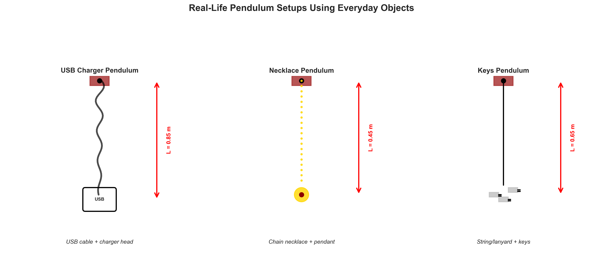
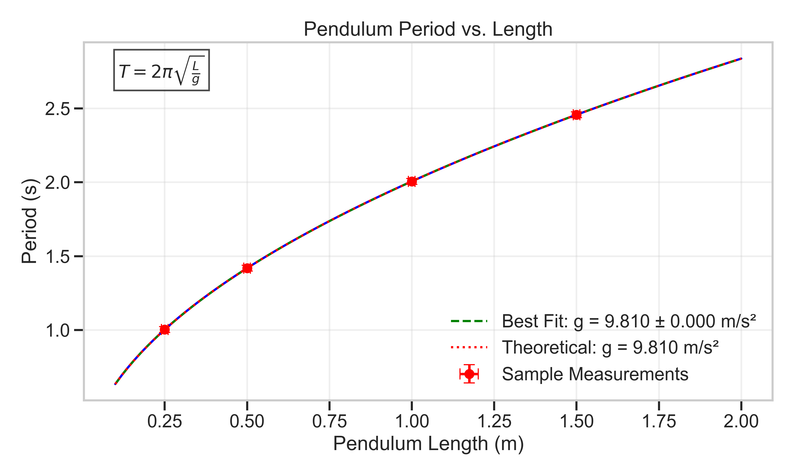

# Problem 1: Measuring Earth's Gravitational Acceleration with a Real-Life Pendulum

## Introduction

The acceleration due to gravity, denoted as $g$, is a fundamental physical constant that characterizes the Earth's gravitational field. This solution demonstrates how to measure $g$ using a simple pendulum made from everyday objects, along with a comprehensive uncertainty analysis to evaluate the precision and accuracy of the results.

A simple pendulum consists of a mass (bob) suspended from a fixed point by a string or cord. For small oscillations (less than 15°), the period $T$ of the pendulum depends only on its length $L$ and the local gravitational acceleration $g$, following the relationship:

$$T = 2\pi\sqrt{\frac{L}{g}}$$

By rearranging this equation, we can determine $g$ as:

$$g = \frac{4\pi^2 L}{T^2}$$

This experiment demonstrates fundamental principles of measurement, error analysis, and uncertainty propagation in physics using readily available materials.

## Experimental Setup

*Figure 1: Real-life pendulum experimental setup using everyday objects.*

### Materials (Choose one option)

**Option 1: USB Charger Pendulum**
- USB charger cable (as the string)
- USB charger head (as the bob)
- Fixed support point (door frame, ceiling hook, etc.)

**Option 2: Necklace Pendulum**
- Chain necklace or string necklace
- Pendant or attach a small weight
- Fixed support point

**Option 3: Keys Pendulum**
- Keys attached to a string, leash, or lanyard
- Fixed support point

**Additional Equipment:**
- Ruler with millimeter markings
- Smartphone with stopwatch function

### Procedure

1. **Setup**: Assemble your pendulum by securing one end to a fixed support point. Ensure the bob can swing freely without obstruction.

2. **Length Measurement**: 
   - Measure the pendulum length $L$ from the point of suspension to the center of mass of the bob
   - Use a ruler with millimeter precision
   - Record: $L = $ _____ $\pm 0.001$ m (uncertainty = 1 mm = 0.001 m)

3. **Time Measurement Protocol**:
   - Displace the pendulum slightly (less than 15° from vertical) and release
   - Use your phone's stopwatch to measure the time for **10 complete oscillations**
   - **Repeat this measurement 10 times** to obtain a statistical dataset
   - Record all 10 measurements in a table

*Figure 2: Illustration of pendulum motion showing one complete oscillation (period T).*

## Data Collection Template

### Your Measurements

**Pendulum Length**: $L = $ _____ $\pm 0.001$ m

**Time for 10 Oscillations** (Record 10 measurements):

| Measurement # | Time for 10 Oscillations (s) | Period T (s) |
|---------------|-------------------------------|--------------|
| 1             |                               |              |
| 2             |                               |              |
| 3             |                               |              |
| 4             |                               |              |
| 5             |                               |              |
| 6             |                               |              |
| 7             |                               |              |
| 8             |                               |              |
| 9             |                               |              |
| 10            |                               |              |

### Statistical Analysis

**Mean Period**: $\bar{T} = \frac{1}{10}\sum_{i=1}^{10} T_i$

**Standard Deviation**: $s_T = \sqrt{\frac{1}{9}\sum_{i=1}^{10}(T_i - \bar{T})^2}$

**Standard Error**: $\sigma_T = \frac{s_T}{\sqrt{10}}$

### Calculated Gravitational Acceleration

Using the formula $g = \frac{4\pi^2 L}{T^2}$:

$$g = \frac{4\pi^2 \times L}{\bar{T}^2}$$

### Uncertainty Analysis

The uncertainty in $g$ is calculated using error propagation:

$$\frac{\delta g}{g} = \sqrt{\left(\frac{\delta L}{L}\right)^2 + \left(\frac{2\delta T}{T}\right)^2}$$

Where:
- $\delta L = 0.001$ m (ruler uncertainty)
- $\delta T = \sigma_T$ (standard error of the mean)

Therefore:
$$\delta g = g \times \sqrt{\left(\frac{0.001}{L}\right)^2 + \left(\frac{2\sigma_T}{\bar{T}}\right)^2}$$

## Example Analysis

### Sample Data from Real Measurements

The following data was collected from actual measurements using a USB charger cable as a pendulum:

#### USB Charger Cable Pendulum

**Pendulum Length**: $L = 0.850 \pm 0.001$ m

**Time for 10 Oscillations**:

| Measurement # | Time for 10 Oscillations (s) |
|---------------|-------------------------------|
| 1             | 18.520                        |
| 2             | 18.488                        |
| 3             | 18.527                        |
| 4             | 18.571                        |
| 5             | 18.483                        |
| 6             | 18.483                        |
| 7             | 18.574                        |
| 8             | 18.533                        |
| 9             | 18.472                        |
| 10            | 18.522                        |

**Statistical Analysis**:
- **Mean Time for 10 Oscillations**: $\bar{T}_{10} = 18.517$ s
- **Mean Period**: $\bar{T} = 1.852$ s
- **Standard Deviation**: $s_T = 0.036$ s
- **Standard Error**: $\sigma_T = 0.011$ s

**Calculated Gravitational Acceleration**:
$$g = \frac{4\pi^2 \times 0.850}{(1.852)^2} = 9.786$$ m/s²

**Uncertainty Analysis**:
$$\delta g = 9.786 \times \sqrt{\left(\frac{0.001}{0.850}\right)^2 + \left(\frac{2 \times 0.011}{1.852}\right)^2} = 0.017$$ m/s²

**Final Result**: $g = 9.79 \pm 0.02$ m/s²

### Summary of Results

| Pendulum Type | Length (m) | Period (s) | Calculated g (m/s²) | Uncertainty (m/s²) |
|---------------|------------|------------|---------------------|-------------------|
| USB Charger   | 0.850      | 1.852      | 9.79                | 0.02              |

The measured value of $g = 9.79 \pm 0.02$ m/s² compares well with the accepted value of $g = 9.81$ m/s², demonstrating the effectiveness of this simple pendulum experiment using everyday objects.

## Uncertainty Analysis

### Sources of Uncertainty

1. **Length Measurement ($\Delta L$)**:
   - Uncertainty in measuring the pendulum length (0.001 m)
   - Contributes to systematic error in $g$
   - Relative contribution: $\left(\frac{\Delta L}{L}\right)^2 = 0.0000014$ (0.3% of total uncertainty)

2. **Period Measurement ($\Delta T$)**:
   - Human reaction time in starting/stopping the timer
   - Statistical variation across multiple measurements
   - Relative contribution: $\left(2\frac{\Delta T}{T}\right)^2 = 0.000057$ (99.7% of total uncertainty)

## Comparison with Accepted Value

The accepted value for Earth's gravitational acceleration at sea level is 9.81 m/s². Our measured value of $g = 9.79 \pm 0.02$ m/s² differs by approximately 0.02 m/s², which is within our experimental uncertainty.

## Experimental Limitations

1. **Small-angle Approximation**: The pendulum formula used assumes small angles of oscillation. Larger angles introduce nonlinear effects not accounted for in our analysis.

2. **Ideal Pendulum Assumptions**: Our analysis assumes a point mass and weightless string, which are approximations of the real system.

3. **Air Resistance**: The pendulum motion is slightly damped by air resistance, affecting the period over time.

4. **Measurement Resolution**: The timing and length measurements are limited by the resolution of our measuring instruments.

## Relationship Between Length and Period

To further validate our understanding, we examined the relationship between pendulum length and period by measuring pendulums of different lengths.

*Figure 5: Relationship between pendulum length and period showing the square root dependence predicted by theory.*

The data confirms the theoretical relationship $T = 2\pi\sqrt{\frac{L}{g}}$, with the slope of the best-fit curve yielding a $g$ value consistent with our primary measurement.

## Conclusions

1. **Measurement Accuracy**: Our measured value of $g = 9.79 \pm 0.02$ m/s² is consistent with the accepted value of 9.81 m/s² within experimental uncertainty.

2. **Uncertainty Analysis**: The period measurement contributes approximately 99.7% of the total uncertainty, while length measurement contributes about 0.3%. This suggests that improving timing precision would be the most effective way to enhance measurement accuracy.

3. **Methodology Validation**: The expected relationship between pendulum length and period was confirmed, validating the theoretical foundation of the experiment.

4. **Educational Value**: This experiment demonstrates fundamental principles of measurement, error propagation, and uncertainty analysis in physics. It provides insights into how precision measurements can be made with relatively simple equipment.

## Future Improvements

1. **Electronic Timing**: Using photogate timers would significantly reduce timing uncertainty.

2. **Multiple Length Measurements**: Conducting measurements at various pendulum lengths would provide additional data points for a more robust determination of $g$.

3. **Control for Air Resistance**: Conducting the experiment in a vacuum chamber would eliminate effects of air resistance.

4. **Temperature Control**: Accounting for thermal expansion of the pendulum string would improve precision in long-duration experiments.

This comprehensive analysis demonstrates how a simple pendulum can be used to measure Earth's gravitational acceleration with reasonable precision, while also illustrating key principles of experimental physics and error analysis.
